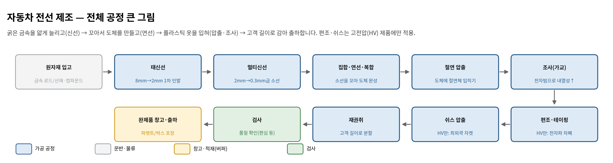
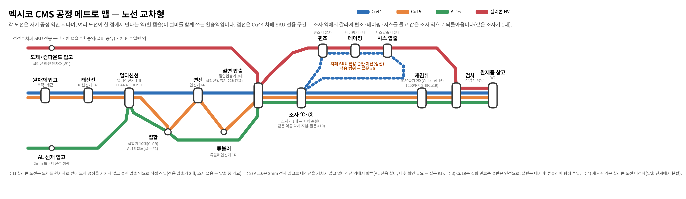
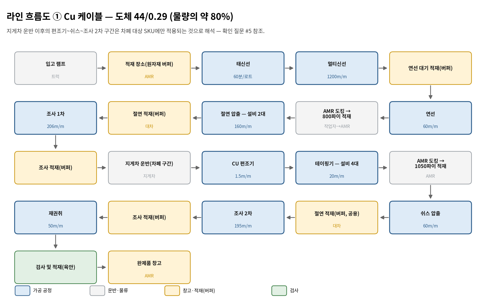
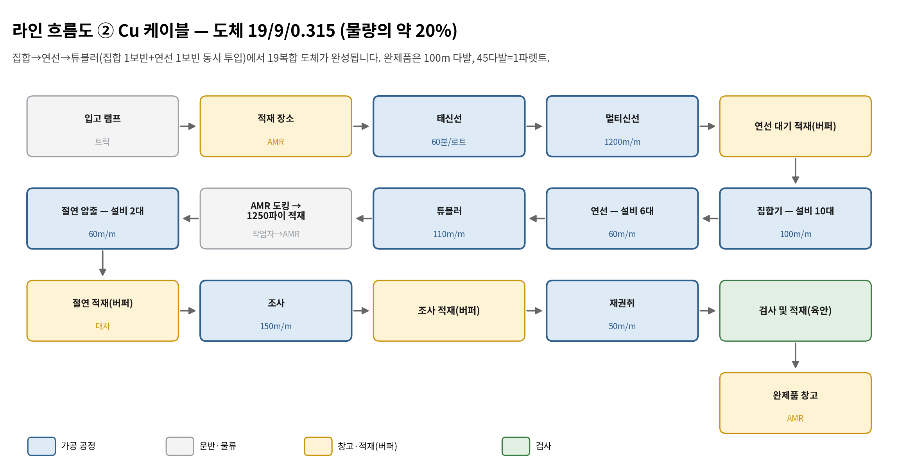
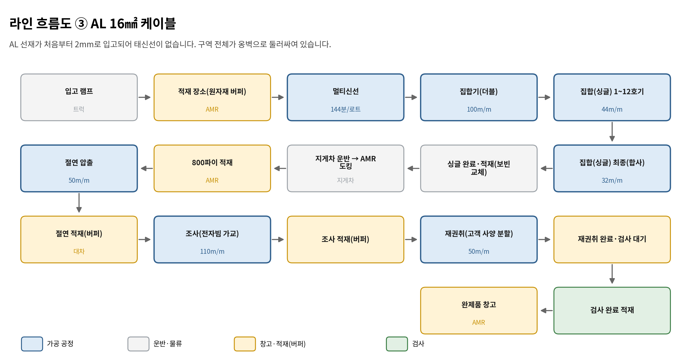
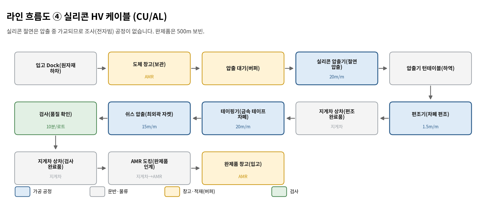
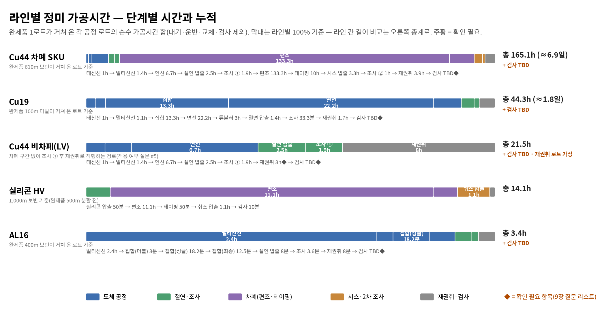

# 멕시코 CMS 공장 표준작업절차서(SOP)

> 자동차 전선 제조 공정 — 일반인 이해용 해설 + 공정 시뮬레이션 파라미터·제약 조건 기준서
>
> **버전** v0.3 (초안) · **발행일** 2026-08-14 · **별첨** 멕시코_CMS_시뮬레이션_파라미터_v0.3.xlsx
> 표기: ⚠**굵은 표시** = 확인 필요 항목(9장 질문 리스트), ◆ = 표에서 확인 필요 행
> **기반 자료** 멕시코 CMS 공정 정리 v0.4(엑셀 5개 시트) · 도체(Cu44·Cu19) 공정 정리 문서 · 기준공정위키(2026-08-14) · 공정 인터뷰(2026-07-01)
> 그림 7종은 같은 폴더의 images/ 하위에 있습니다(상대 경로 링크). Word(docx) 판과 동일 내용입니다.

---

## 1. 문서 개요

### 1.1 목적

이 문서는 멕시코 CMS(CMX 신규 투자) 공장의 자동차 전선 제조 공정을 정리한 표준작업절차서(SOP)입니다. 두 가지 목적을 갖습니다. 첫째, 전선 제조를 처음 접하는 사람도 각 공정이 무엇을, 왜, 어떻게 하는지 글만 읽고 이해할 수 있도록 서술형으로 설명합니다. 둘째, 공정 시뮬레이션을 구축하는 엔지니어가 모델 입력값(파라미터)과 제약 조건을 바로 도출할 수 있도록, 모든 수치와 규칙을 근거와 함께 제공합니다. 표는 꼭 필요한 경우에만 보조 자료로 사용하며, 표에 담긴 내용은 본문에서 먼저 서술로 설명합니다.

### 1.2 적용 범위

이 문서가 다루는 것은 멕시코 CMS 공장에서 생산하는 네 가지 제품 라인, 즉 구리 도체 44/0.29 기반 케이블(Cu44, 전체 물량의 약 80%), 구리 도체 19/9/0.315 기반 케이블(Cu19, 약 20%), 알루미늄 16㎟ 케이블(AL16), 그리고 전기차용 실리콘 절연 고전압 케이블(실리콘 HV, CU/AL 두 종)입니다. 원자재 입고부터 완제품 창고 입고까지의 전 과정을 포함하고, 공장 내 운반(AMR·지게차·대차)도 다룹니다. 센서 케이블과 이더넷 케이블은 CMX 과업 범위에서 제외되어 있으므로 이 문서에서도 다루지 않습니다.

### 1.3 문서를 읽는 방법

전선 제조가 처음이라면 2장(전체 구성)과 4장(공정 상세)의 서술만 따라가도 전체 흐름을 이해할 수 있고, 모르는 용어는 별첨 용어집(10.1)에서 찾을 수 있습니다. 현장 운영 관점에서는 4장의 표준 작업 절차와 6장(설비·교체·캘린더)이 기준이 됩니다. 시뮬레이션 엔지니어라면 5장(라우팅·소요 시간), 7장(제약 조건), 8장(파라미터 도출)과 별첨 워크북을 중심으로 읽으면 됩니다.

4장의 공정은 「공정 1」부터 「공정 6」까지의 대공정과 그 아래 1.1, 1.2 같은 세부공정 순번으로 구분합니다. 예를 들어 태신선은 도체 공정(공정 2)의 첫 세부공정이므로 2.1입니다. 이 순번은 5장 라우팅 표에도 동일하게 표기되어, 표의 한 행이 어느 공정에 속하는지 바로 연결됩니다. 목차의 항목을 클릭(Ctrl+클릭)하면 해당 위치로 이동합니다.

### 1.4 참조 문서

- 멕시코 CMS 공정 정리 v0.4 — 원본 데이터. 엑셀 5개 시트(실리콘 / AL16 / 도체(44) / 도체(19) / 공정별 교체시간). 본문 출처 표기 예: [실리콘!J29]
- 도체(Cu44, Cu19) 공정 정리 문서 — 설비 대수·확정 로트·공정시간의 출처. 본문 출처 표기: [도체정리]
- 기준공정위키(2026-08-14) — 공정 일반 지식과 용어의 출처
- 별첨 워크북: 멕시코_CMS_시뮬레이션_파라미터_v0.3.xlsx — 본 문서의 모든 수치를 시뮬레이션 입력용으로 구조화

### 1.5 표기 원칙 — 확인이 필요한 정보의 구분

이 문서의 정보는 두 가지뿐입니다. 검은 글씨는 원본 자료에 기재되어 있거나 원본 값으로 계산되어 확정된 정보입니다. ⚠**주황 글씨**는 원본이 모호하거나 서로 어긋나서 아직 확정하지 못한, 현장 확인이 필요한 정보입니다. 값 자체가 없는 항목은 TBD로 적습니다. 표에서는 확인이 필요한 칸에 주황 음영과 ◆ 표시를 사용합니다. 주황으로 표시된 항목은 모두 9장의 확인 질문 리스트에 번호로 연결되어 있으며, 답이 확인되는 대로 검은 글씨로 바뀝니다. 각 수치 뒤의 대괄호([도체정리], [실리콘!J29] 등)는 그 값의 출처입니다.

### 1.6 자주 쓰는 단위

선속은 케이블이 설비를 통과하는 속도로, 원본 자료의 'm/m'은 분당 미터(m/min)를 뜻합니다. 보빈은 케이블을 감는 큰 릴이며 지름을 Φ(파이, mm)로 부릅니다 — 이 공장에는 630Φ, 800Φ, 1050Φ, 1250Φ가 쓰입니다. 캐리어는 태신선이 쓰는 1톤 단위 운반 용기, 다발은 보빈 없이 감은 코일 묶음, 파렛트는 출하 적재 단위입니다. 'AL 16스퀘어'처럼 스퀘어(㎟)는 도체 단면적을 뜻합니다. 상세한 환산은 별첨 10.2에 있습니다.

---

## 2. 전체 구성 — 4개 라인과 그 연관 관계

### 2.1 전체 공정은 어떻게 구성되는가

멕시코 CMS 공장은 하나의 공장 안에서 네 개의 제품 라인이 돌아가는 구조입니다. 즉 '전체 공정이 4개로 구성되는가'라는 물음에는 제품 기준으로는 그렇다(4개 라인)고 답할 수 있고, 공정 기준으로는 여섯 개의 대공정(원자재 입고·보관 → 도체 → 절연 → 차폐 → 시스 → 완성·출하)을 네 라인이 각자 필요한 만큼만 거쳐 가는 격자 구조라고 답하는 것이 더 정확합니다. 어떤 라인도 여섯 대공정을 전부 거치지는 않습니다.

네 라인을 간단히 소개하면 이렇습니다. Cu44는 8mm 구리 로드에서 출발해 0.29mm 소선 44가닥짜리 도체를 만드는 주력 라인으로, 전체 물량의 약 80%를 차지합니다. 절연·조사까지 마치면 완제품이 되는 것이 기본이고, ⚠**차폐가 필요한 일부 SKU만 편조~시스 구간을 추가로 거치는 것으로 해석됩니다(질문 #5)**. Cu19는 같은 구리 로드에서 출발하지만 집합·연선·튜블러의 3단 꼬임으로 19복합 도체를 만드는 라인이며 약 20%를 차지하고, 완제품이 100m 다발로 나갑니다. AL16은 알루미늄 16㎟ 케이블 라인인데 2mm 선재가 바로 입고되므로 태신선이 없고, 구역 전체가 옹벽으로 둘러싸여 있습니다. 실리콘 HV는 전기차용 고전압 케이블 라인으로, 도체를 원자재 상태로 받아 실리콘 절연을 입히고 편조·테이핑·시스로 차폐하는데, 실리콘이 압출 중에 스스로 가교되기 때문에 전자빔 조사 공정이 없습니다.

### 2.2 라인 사이의 연관 관계

네 라인은 독립적으로 그려지지만 실제로는 네 가지 방식으로 얽혀 있고, 이 얽힘이 시뮬레이션에서 라인을 따로 계산할 수 없는 이유입니다.

첫째, 원자재를 공유합니다. Cu44와 Cu19는 같은 8mm 구리 로드를 쓰며, 같은 트럭(월 13대)으로 함께 입고되어 멀티신선까지는 같은 설비를 지나다가 멀티신선에서 44타입과 19타입으로 갈라집니다 [도체정리]. 둘째, 설비를 공유합니다. 태신선기(1대)·멀티신선기(1대)·연선기(6대)는 Cu44와 Cu19가 함께 쓰고, 절연압출기(2대)와 조사기(1대)는 AL16까지 세 라인이 함께 쓰며, 재권취기는 1050Φ용 2대를 Cu44와 AL16이 공유합니다. 특히 멀티신선기는 Cu44를 4회 생산한 뒤 Cu19를 1회 생산하는 사이클로 운영되고 [도체정리], ⚠**조사기 1대는 절연 조사와 시스 조사까지 겸하는 것으로 기재되어 있어(질문 #19)** 사실이라면 공장에서 가장 붐비는 환승역이 됩니다. 셋째, 물류와 창고를 공유합니다. AMR과 지게차, 완제품 창고(W2), 검사 구역은 전 라인 공용입니다. 넷째, 반대로 독립된 요소도 있습니다. AL16의 도체 설비는 AL 전용이고, 실리콘 라인은 전용 압출기 2대(좌측 CU, 우측 AL)를 쓰며 도체 공정을 아예 거치지 않습니다.

정리하면, 네 라인은 '같은 역(공정)을 지나는 네 개의 지하철 노선'이고, 공유 설비가 있는 역은 노선들이 겹치는 환승역입니다. 환승역에서는 한 노선이 설비를 쓰는 동안 다른 노선이 기다려야 하므로, 여기가 시뮬레이션에서 대기와 병목이 생기는 지점입니다. 이 구조를 2.5의 메트로 맵으로 그렸습니다.

### 2.3 전선이 만들어지는 순서 — 큰 이야기

자동차 전선의 구조는 단순합니다. 가운데에 전기가 흐르는 금속 심(도체)이 있고, 그 위에 전기가 새지 않게 하는 플라스틱 옷(절연체)을 입힙니다. 전기차용 고전압 전선은 여기에 전자파를 막는 금속 갑옷(편조 차폐)과 바깥 보호 겉옷(시스)을 한 겹씩 더 입힙니다.

공장이 하는 일은 크게 두 단계입니다. 앞 단계(도체 공정)에서는 굵은 금속 막대를 엿가락처럼 점점 얇게 늘리고(신선), 가늘어진 선 수십 가닥을 꼬아서(연선) 튼튼하고 유연한 도체를 만듭니다. 한 번에 얇게 만들 수 없어 태신선(8mm→2mm)과 멀티신선(2mm→0.3mm급) 두 번에 나눠 늘립니다. 뒷 단계(피복 공정)에서는 도체에 녹인 플라스틱(컴파운드)을 입히고(압출), 전자빔을 쏘아 분자를 그물처럼 엮어 열에 강하게 만들며(조사·가교), 고객이 원하는 길이로 다시 감아(재권취) 검사 후 출하합니다.

공장 안에서 재료와 반제품은 보빈에 감겨 이동하고, 운반은 AMR·지게차·대차가 나눠 맡습니다. 각 공정 앞뒤의 적재 장소(버퍼)에서 재고가 대기하는데, 공정마다 속도가 크게 달라서(가장 빠른 멀티신선 1,200m/min과 가장 느린 편조 1.5m/min은 800배 차이) 이 대기와 재고 흐름이 시뮬레이션 분석의 핵심이 됩니다.

### 2.4 전체 공정 큰 그림

아래 그림은 여섯 대공정을 한 줄로 펼친 것입니다. 파란 상자가 가공 공정, 회색이 운반, 노랑이 창고·버퍼, 초록이 검사입니다.

*그림: 전체 공정 큰 그림*

### 2.5 메트로 맵 — 교차하는 4개 노선과 설비 환승역

아래 메트로 맵이 이 문서의 중심 그림입니다. 실제 지하철 노선도처럼 네 개의 제품 노선이 굽고 갈라지고 교차하며, 여러 노선이 한 점에서 만나는 역(흰 캡슐)이 바로 설비를 함께 쓰는 환승역입니다. Cu44(파랑)는 간선을 곧게 달리고, Cu19(주황)는 집합과 튜블러 역으로 지그재그 내려갔다 올라오며, AL16(초록)은 왼쪽 아래에서 출발해 멀티신선 역에서 합류하고, 실리콘(빨강)은 위쪽에서 내려와 절연 압출 환승역을 찍고 차폐 구간(편조·테이핑·시스)으로 올라갑니다. 파란 점선은 Cu44 차폐 SKU 전용 순환 지선으로, 조사 역에서 갈라져 차폐 구간을 한 바퀴 돌고 같은 조사 역으로 되돌아옵니다 — ⚠**같은 조사기 1대가 두 시점(조사 ①·②)에 다시 쓰인다는 뜻입니다(질문 #19)**. 역 이름 옆에는 그 역의 설비와 대수를 적었습니다.

*그림: 메트로 맵 — 교차하는 4개 노선과 설비 환승역*

- 환승역(흰 캡슐): 원자재 입고·태신선·멀티신선·연선·절연 압출·조사·재권취·검사·완제품 창고 — 여러 노선이 한 점으로 모이며, 한 노선이 설비를 쓰는 동안 다른 노선이 대기합니다. 멀티신선은 Cu44 4회 → Cu19 1회 사이클로 운영됩니다 [도체정리].
- 노선의 갈라짐과 합류: Cu19는 멀티신선 이후 집합·튜블러로 갈라졌다가 절연 압출에서 다시 합류하고, AL16은 자기 전용 입고 지점에서 출발해 멀티신선 역에서 처음 합류합니다. 실리콘은 도체 구간을 아예 지나지 않는 별도 노선입니다.
- 순환 지선(점선): 조사 → 편조 → 테이핑 → 시스 → 조사로 돌아오는 고리가 ⚠**차폐 SKU만 타는 조건부 경로(질문 #5)**이며, 편조·테이핑·시스 역에서는 실리콘 노선과 나란히 지나므로 이 구간 설비의 공유 여부가 확인 대상입니다(질문 #1).
- 재권취 역은 보빈 규격에 따라 1050Φ기(Cu44·AL16 공유)와 1250Φ기(Cu19)로 나뉘고, 실리콘 노선은 이 역에 정차하지 않습니다(압출 단계에서 분할).

---

## 3. 공장 구성과 물류

### 3.1 위치 코드

원본 자료는 공장 안의 모든 지점을 코드로 부릅니다. R로 시작하면 입고 지점, W는 창고, S는 실리콘 구역, A는 AL16 구역, E는 메인 공정 구역, F는 지게차 상·하차 지점입니다. 시뮬레이션 레이아웃에서는 이 코드가 노드(node)가 됩니다. 아래 표는 참조용 요약입니다.

| 코드 | 구역 | 설명 |
| --- | --- | --- |
| R1 / R3 | 입고 Dock / 입고 램프 | 트럭이 원자재를 내리는 곳 |
| W1 | 도체(원자재) 창고 | 실리콘 라인용 도체 보관 |
| W2 | 완제품 창고 | 전 라인 공통 출하 대기 |
| S1~S9 | 실리콘 라인 구역 | 압출 대기부터 검사·AMR 도킹까지 |
| A1~A9 | AL16 도체 구역 | 옹벽으로 둘러싸인 구역 |
| E1~E25 | 메인 공정 구역 | Cu 도체 공정부터 절연·조사·차폐·재권취·검사까지 |
| F1~F4 | 지게차 상·하차 위치 | 공정 간 지게차 인계 지점 |

### 3.2 운반 수단

공장 내 운반은 네 가지 수단이 나눠 맡습니다. AMR(자율주행 운반 로봇)은 창고와 공정 구역 사이의 장거리 정형 반송을 담당하며 속도는 5km/h(약 83.3m/min)입니다 [실리콘!L10]. 지게차도 같은 5km/h로 [실리콘!M27], 무거운 보빈을 F1~F4 지점을 거쳐 공정 사이로 옮기고, Cu 로드 하차에는 4톤 지게차가 쓰입니다. 대차와 작업자는 압출→조사 적재 같은 근거리 이동과 보빈 교체·검사·AMR 도킹 인계를 맡는데 ⚠**이동 속도가 기재되어 있지 않습니다(질문 #14)**. AMR 충전 스테이션은 QA 영역 아래쪽 또는 도체 창고 아래쪽이 후보이고 [실리콘!F32], ⚠**AMR 대수와 충전 정책(충전 시간·배터리 지속시간)은 미확인입니다(질문 #14)**. 결정적으로, ⚠**위치 간 이동 거리(레이아웃 도면)가 아직 없어 운반 시간을 계산할 수 없습니다(질문 #14)** — 거리 매트릭스 확보가 물류 모델의 선결 조건입니다.

### 3.3 창고와 버퍼

각 공정 앞뒤에는 반제품이 대기하는 적재 장소(버퍼)가 있습니다. 시뮬레이션에서는 대기 행렬(queue)로 모델링되는 지점이며, 재고가 쌓이는 위치이므로 어느 버퍼가 차오르는지가 병목을 읽는 단서가 됩니다. ⚠**모든 버퍼의 보관 용량(적재 가능 보빈 수)이 미확인이고(질문 #15)**, AS/RS(자동창고) 도입 여부도 검토 대상입니다 [실리콘!E43]. 아래 표는 버퍼 위치 목록입니다.

| 위치 | 버퍼 | 사용 라인 | 대기 대상 |
| --- | --- | --- | --- |
| W1 | 도체 창고 | 실리콘 | 도체 원자재(1t 단위) |
| S1 | 압출 대기 | 실리콘 | 압출 투입 전 도체 |
| A1 | 적재 장소 | AL16 | 2mm AL 롤 |
| E1 | 적재 장소 | Cu44·Cu19 | 8mm Cu 로드 보빈(3.3t) |
| E5 | 연선 대기 적재 | Cu44·Cu19 | 멀티신선 완료 보빈(800Φ) |
| E11 | 800/1050/1250파이 적재 | AL16·Cu44·Cu19 | 절연 투입 전 도체 |
| E14 | 절연 적재 | 공용 | 절연 완료(조사 대기) |
| E17 | 조사 적재 | 공용 | 조사 완료 |
| E24 | 검사 대기 | 공용 | 재권취 완료품 |
| W2 | 완제품 창고 | 전 라인 | 출하 대기 완제품 |

---

## 4. 공정 상세 — 대공정과 세부공정

이 장은 공정을 「공정 1」~「공정 6」의 대공정으로 나누고, 각 대공정 아래 세부공정을 1.1, 1.2 순번으로 설명합니다. 세부공정마다 무엇을 하는 공정인지, 무엇이 들어가고(인풋) 무엇이 나오는지(아웃풋), 라인별 조건이 어떻게 다른지를 서술로 먼저 설명하고, 수치는 마지막에 보조 표로 요약합니다. 표의 '로트당 시간'은 로트 길이를 선속으로 나눈 순수 가공시간이며 대기·운반·교체 시간은 포함하지 않습니다. 표준 작업 절차 항목은 원본 자료에 절차 기술이 없어 업계 일반 관행으로 작성한 골격이므로 ⚠**설비 반입 후 현장 작업표준으로 확정해야 합니다**.

### 공정 1. 원자재 입고·보관

트럭으로 도착한 원자재를 계량하고 내려서 각 라인의 원자재 버퍼에 쌓아 두는 대공정입니다. 시뮬레이션에서는 자재가 시스템에 나타나는 '도착 프로세스'가 되며, 라인마다 입고 주기·단위·보관 규칙이 다릅니다.

#### 1.1 입고·계근

【무엇을 하는 공정인가】 원자재를 실은 트럭이 정문을 지나 계근대(차량용 저울)에서 무게를 확인하고 지정된 하차 지점(R1 Dock 또는 R3 램프)으로 이동하는 단계입니다. 여기서 입고 예정 정보와 실물(품목·수량·중량)이 대조됩니다. 원문의 '개근대'는 계근대로 해석했습니다.

【인풋】 원자재 적재 트럭. Cu 로드는 50피트 차량 1대에 3.3t 롤 6개(19.8t), AL16용 2mm 선재는 하루 2롤(2t), 실리콘 라인 자재는 2주 1회 5t 단위입니다.

【아웃풋】 계량·검수를 마치고 하차 지점에 도착한 트럭.

【라인별 조건】 Cu44·Cu19는 같은 원자재를 쓰며 월 13대(257.4t)가 대부분 월초에 몰려 들어옵니다 [도체정리]. AL16은 월초부터 12일간 하루 2롤씩 총 24t이 들어옵니다 [AL16!I9~L9]. 실리콘 라인은 도체 원자재가 2주 1회 5t씩(월 사용량 AL 기준 25t), 실리콘 컴파운드가 15일 1회 500kg 박스 단위로 들어오며 컴파운드는 최대 보관 15일의 유효기간 제약이 있습니다 [실리콘!N9·N10·F27].

【표준 작업 절차】 ⚠**현장 확정 필요**

1. 입고 예정 정보(차량·품목·수량) 확인 후 게이트 통과
2. 계근대 계량 및 서류 대조
3. 지정 Dock/램프로 유도

- Cu 입고가 월초에 집중되므로 도착 프로세스를 균등 분포로 두면 재고 곡선이 실제와 달라집니다 — 월초 집중 패턴으로 모델링해야 합니다(7.2절).

#### 1.2 하차·적재

【무엇을 하는 공정인가】 트럭에서 원자재를 내려 각 라인의 원자재 버퍼로 옮겨 쌓는 단계입니다. Cu 로드처럼 무거운 자재는 4톤 지게차가, 구역 간 반송은 AMR이 맡습니다.

【인풋】 하차 지점에 도착한 원자재(Cu 로드 3.3t 롤, 2mm AL 롤, 도체·컴파운드 등).

【아웃풋】 라인별 원자재 버퍼(E1, A1, W1)에 적재된 자재. 이때부터 공정 투입 대기 재고가 됩니다.

【라인별 조건】 Cu 로드는 4톤 지게차가 E1에 적재하고 [도체(44)!C3], AL16 롤은 AMR이 A1으로, 실리콘 도체는 AMR이 W1 도체 창고로 옮깁니다(모두 5km/h). 실리콘 컴파운드는 유효기간 관리 때문에 선입선출(FIFO)이 필수입니다.

【표준 작업 절차】 ⚠**현장 확정 필요**

1. 하차 및 외관·수량 검수
2. 입고 등록(자재 코드·로트 라벨)
3. 지게차/AMR로 지정 버퍼에 적재
4. 재고 시스템 갱신

### 공정 2. 도체 공정 — 전선의 금속 심 만들기

도체 공정은 굵은 금속을 가늘게 늘리는 신선(2.1 태신선, 2.2 멀티신선)과 가늘어진 선을 꼬아 묶는 연선(2.3 집합, 2.4 연선, 2.5 튜블러)으로 이루어집니다. 왜 가늘게 만든 뒤 다시 꼬는가 하면, 굵은 통짜 금속선은 뻣뻣해서 자동차 안의 좁은 경로에 배선할 수 없기 때문입니다. 머리카락 굵기의 소선 수십 가닥을 꼬면 같은 단면적이라도 유연하고 끊어지지 않는 도체가 됩니다. 실리콘 라인은 도체를 원자재로 구매하므로 이 대공정을 거치지 않고, AL16은 2mm 선재로 입고되어 2.2부터 시작합니다.

#### 2.1 태신선 — 8mm를 2mm로 늘리는 1차 인발

【무엇을 하는 공정인가】 8mm 구리 로드를 다이스(구멍이 뚫린 초경 금형) 여러 개에 차례로 통과시키며 2mm까지 늘리는 공정입니다. 금속은 한 번에 크게 줄일 수 없어서 단계적으로 가늘게 만드는데, 그 첫 번째 큰 단계가 태신선입니다. 굵기가 4분의 1이 되는 동안 길이는 약 16배로 늘어납니다. 태신선기는 1대뿐이며 Cu44와 Cu19가 함께 씁니다 [도체정리].

【인풋】 8mm Cu 로드 보빈 1개(3.3t). E1 버퍼에서 투입됩니다.

【아웃풋】 2mm 선재를 감은 캐리어(1t 운반 용기) 3개. 1캐리어에는 약 38,125m가 감깁니다 [도체정리].

【라인별 조건】 선속은 1,906m/min로, 20분마다 캐리어 1개가 차고 보빈 1개(3.3t)를 처리하는 데 1시간이 걸립니다 [도체정리]. 계산으로도 1,906m/min×20분=38,120m로 캐리어 용량과 정확히 맞습니다. 하루 최대 80t을 처리할 수 있어서 [도체(44)!N11] 월 소요량 257.4t을 약 3.2일 만에 끝냅니다 — 그래서 태신선은 월초 3일 정도만 집중 가동하는 배치 운전 패턴이 됩니다. 품종 교체는 월 1회, 2시간입니다.

| 라인 | 로트 (인풋 → 아웃풋) | 속도/시간 | 로트당 시간 |
| --- | --- | --- | --- |
| CU44 | 1보빈(3.3t) → 캐리어(1t)×3 | 60분/로트 | 60분 |

【표준 작업 절차】 ⚠**현장 확정 필요**

1. 로드 보빈(3.3t)을 페이오프에 장착하고 선단을 다이스 열에 통과시켜 인취부에 연결
2. 윤활액 순환·다이스 마모 점검 후 가동
3. 가동 중 단선·표면 결함 감시
4. 20분마다 캐리어 교체·라벨 부착 후 완료 적재(E3)
5. 생산 실적 기록

- 월초 집중 가동(배치 패턴)이므로 시뮬레이션 캘린더에서 상시 가동으로 두면 안 됩니다.

#### 2.2 멀티신선 — 여러 가닥을 동시에 머리카락 굵기로

【무엇을 하는 공정인가】 2mm 선재 여러 가닥을 나란히 넣고 동시에 0.29~0.32mm까지 뽑아내는 공정입니다. 한 대의 설비가 수십 가닥을 한꺼번에 처리해 완성 도체에 필요한 소선을 만들며, Cu44의 경우 10가닥짜리 2조와 8가닥짜리 3조, 합계 44가닥 구성으로 뽑습니다 [도체(44)!C3]. Cu용 멀티신선기는 1대뿐이라 Cu44를 4회 생산한 뒤 Cu19를 1회 생산하는 사이클을 반복합니다 [도체정리] — 이 4:1 규칙이 도체 공정 스케줄의 뼈대입니다.

【인풋】 2mm 선재. Cu는 캐리어 24개(24t, 약 915,000m)를 한 배치로 투입하고, AL16은 2mm AL 롤(하루 2롤)을 투입합니다.

【아웃풋】 800Φ 보빈에 감긴 소선 묶음. Cu44는 100,000m 보빈 9개, Cu19는 80,000m 보빈 11개가 한 배치의 산출입니다 [도체정리]. AL16은 40,000m(200kg) 보빈으로 나옵니다.

【라인별 조건】 선속은 Cu 1,200m/min으로 Cu44 보빈 1개에 1시간 23분 20초, 배치 전체(9개)에 약 12시간 30분이 걸리고, Cu19는 보빈당 1시간 6분 40초, 배치(11개)에 약 12시간 13분입니다 [도체정리]. AL16은 보빈 1개에 2.4시간, 하루 10보빈(2t)으로 입고 페이스와 정확히 맞물립니다 [AL16!N12]. ⚠**배치 물량 수지에 1.6~3.8%의 차이(인풋 915,000m 대비 산출 Cu44 900,000m·Cu19 880,000m)가 있는데 스크랩인지 환산 반올림인지 미확인입니다(질문 #20)**. 교체는 2시간입니다.

| 라인 | 로트 (인풋 → 아웃풋) | 속도/시간 | 로트당 시간 |
| --- | --- | --- | --- |
| CU44 | 24t(≈915,000m) → 100,000m×9개 | 1200m/m | 83.3분 |
| CU19 | 24t(≈915,000m) → 80,000m×11개 | 1200m/m | 66.7분 |
| AL16 | 하루 2롤(2t) → 1보빈(40,000m·200kg) | 144분/로트 | 144분 |

【표준 작업 절차】 ⚠**현장 확정 필요**

1. 2mm 선재를 페이오프에 장착(다수 가닥 동시)
2. 다이스 열·윤활 점검 후 저속 기동 → 정속 전환
3. 단선 시 자동정지 확인 및 재연결
4. 만권 보빈(800Φ) 교체·라벨
5. 실적 기록

- Cu44 4회 → Cu19 1회 사이클을 시뮬레이션 스케줄 규칙로 구현해야 합니다(7.2절).

#### 2.3 집합 — 소선을 모아 다발로

【무엇을 하는 공정인가】 가는 소선 여러 가닥을 처음으로 꼬아 다발을 만드는 공정입니다. 꼬임 간격(피치)을 일정하게 유지하며 소선들을 한 몸으로 묶습니다. Cu19 라인은 집합기 10대를 쓰고 [도체정리], AL16 라인은 더블 집합기 1대와 싱글 집합기 12대를 조합해 씁니다.

【인풋】 멀티신선을 마친 소선 보빈. Cu19는 80,000m 보빈, AL16은 40,000m 보빈이 들어갑니다.

【아웃풋】 집합 완료 보빈. Cu19는 길이가 그대로 유지되어 80,000m 보빈으로 나오고 [도체정리], AL16은 더블 집합에서 800m 보빈으로, 싱글 최종 합사에서 400m 보빈으로 줄며 나옵니다.

【라인별 조건】 Cu19 집합은 100m/min으로 보빈 1개에 13시간 20분이 걸립니다 [도체정리]. 산출된 집합 완료품은 절반이 연선으로 가고, 절반은 대기했다가 연선 완료품과 함께 튜블러에 투입됩니다 — 이 분기 규칙이 Cu19 라우팅의 특징입니다. AL16은 더블(100m/min)→싱글 12대 병렬(44m/min)→최종 합사(32m/min, 하루 10보빈=4,000m)로 이어지며, 최종 합사 10보빈/일이 AL16 라인 전체의 페이스메이커입니다 [AL16!N17]. 교체는 2시간입니다.

| 라인 | 로트 (인풋 → 아웃풋) | 속도/시간 | 로트당 시간 |
| --- | --- | --- | --- |
| CU19 | 보빈(800Φ, 80,000m) → 1보빈(80,000m) | 100m/m | 800분 |
| AL16 | 보빈(800Φ, 40,000m) → 1보빈(800m) | 100m/m | 8분 |
| AL16 | 보빈(800Φ, 800m) → - | 44m/m | 18.2분 |
| AL16 | 싱글-1 1가닥 + 싱글-12 12가닥 → 1보빈(400m) | 32m/m | 12.5분 |

【표준 작업 절차】 ⚠**현장 확정 필요**

1. 소선 보빈들을 크래들에 장착하고 각 가닥을 집합 다이스로 유도
2. 꼬임 피치 설정 확인 후 가동
3. 장력 불균형·단선 감시
4. 만권 시 보빈 교체(규격 주의)
5. 실적 기록

#### 2.4 연선 — 다발을 크게 꼬아 도체로

【무엇을 하는 공정인가】 소선 다발을 다시 크게 꼬아 도체를 완성해 가는 공정입니다. 연선기 6대를 Cu44와 Cu19가 공유합니다 [도체정리]. Cu44는 여기서 최종 도체가 완성되고, Cu19는 튜블러 투입용 연선 완료선을 만듭니다.

【인풋】 Cu44는 멀티신선 완료 보빈(100,000m), Cu19는 집합 완료 보빈(80,000m)이 들어갑니다.

【아웃풋】 Cu44는 24,000m 도체 보빈(100,000m 인풋당 4개 남짓), Cu19는 길이가 유지된 80,000m 연선 완료 보빈이 나옵니다 [도체정리].

【라인별 조건】 선속은 60m/min입니다. Cu44는 보빈 1개(24,000m)에 6시간 40분, Cu19는 1개(80,000m)에 22시간 13분이 걸립니다 [도체정리]. 1대당 하루 최대 약 80,000m를 처리하는데, 이는 이론능력(86,400m)의 92.6%로 — 이 92.6%가 문서 전체에서 실효 가동률의 기본 제안값으로 쓰이는 근거입니다. 교체는 2시간입니다.

| 라인 | 로트 (인풋 → 아웃풋) | 속도/시간 | 로트당 시간 |
| --- | --- | --- | --- |
| CU44 | 보빈(800Φ, 100,000m) → 1보빈(24,000m) | 60m/m | 400분 |
| CU19 | 집합 완료 보빈(80,000m) → 1보빈(80,000m) | 60m/m | 1333.3분 |

【표준 작업 절차】 ⚠**현장 확정 필요**

1. 다발 보빈을 크래들에 장착
2. 꼬임 방향·피치 확인 후 가동
3. 단선·스트랜드 돌출 감시
4. 만권 시 보빈 교체
5. 실적 기록

#### 2.5 튜블러 — 19복합 도체의 완성

【무엇을 하는 공정인가】 튜블러연선기(태연선기)는 큰 통이 회전하면서 여러 가닥을 한 번에 꼬는 설비로, Cu19 전용이며 1대가 있습니다 [도체정리]. 집합만 마친 선과 연선까지 마친 선을 함께 투입해 최종 19복합 도체를 완성합니다. 구 시트에 적힌 '630Φ 보빈 12개 + 800Φ 보빈 1개'는 ⚠**설비에 장착되는 보빈 배열(중심 1 + 외곽 12 = 19복합 구조)을 가리키는 것으로 해석됩니다**.

【인풋】 집합 완료선 80,000m 보빈 1개 + 연선 완료선 80,000m 보빈 1개 [도체정리]. 두 로트가 동시에 있어야 시작할 수 있는 병합 공정입니다.

【아웃풋】 1250Φ 다발에 감긴 완성 도체 20,000m × 4개 [도체정리].

【라인별 조건】 선속 110m/min으로 다발 1개(20,000m)에 약 3시간 2분, 산출 4개 전체에 약 12시간 7분이 걸립니다 [도체정리]. 처리능력은 하루 4t이며 '24일에 100t'이라는 기재가 월 가동일 약 24일의 근거가 됩니다 [도체(19)!N18]. 교체는 2시간입니다.

| 라인 | 로트 (인풋 → 아웃풋) | 속도/시간 | 로트당 시간 |
| --- | --- | --- | --- |
| CU19 | 집합 완료 80,000m×1 + 연선 완료 80,000m×1 → 20,000m×4개 | 110m/m | 181.8분 |

【표준 작업 절차】 ⚠**현장 확정 필요**

1. 집합·연선 완료 보빈을 배열대로 장착
2. 꼬임 방향·피치 확인 후 가동
3. 단선·장력 감시
4. 만권 다발 교체
5. 실적 기록

- 인풋 2로트(집합+연선)가 모두 도착해야 시작되는 병합 공정 — 시뮬레이션에서 조립(assembly) 로직으로 구현합니다(7.3절).

### 공정 3. 절연 공정 — 도체에 옷 입히기

완성된 도체에 절연체를 입히는 대공정입니다. 절연체가 있어야 전기가 밖으로 새지 않고 옆 전선과 닿아도 합선되지 않습니다. 일반 컴파운드는 압출(3.1) 후 전자빔 조사(3.3)로 내열성을 높이고, 실리콘(3.2)은 압출 중에 가교까지 끝나므로 조사가 필요 없습니다.

#### 3.1 절연 압출 — 녹인 플라스틱을 도체에 입히기

【무엇을 하는 공정인가】 압출기는 도체를 풀어 주는 페이오프, 컴파운드를 150~250℃로 녹여 도체 표면에 균일하게 입히는 실린더·헤드, 입힌 절연체를 굳히는 냉각 수조, 완성품을 감는 테이크업으로 구성되며, 설비 간 속도 차이를 흡수하는 저선기가 사이에 들어갑니다(기준공정위키). 색은 뉴트럴 컴파운드에 착색 원료(CMB)를 배합해 내며, 색 변경 시 CMB만 바꾸면 됩니다. 절연압출기는 2대를 Cu44·Cu19·AL16 세 라인이 공유합니다 [도체정리].

【인풋】 완성 도체. Cu44는 24,000m 보빈, Cu19는 20,000m 다발(1250Φ), AL16은 400m 보빈(1050Φ)이 들어갑니다.

【아웃풋】 절연이 입혀진 전선. Cu44는 길이 유지(24,000m), Cu19는 5,000m 다발 4개로 분할 권취, AL16은 400m 보빈 그대로 나옵니다.

【라인별 조건】 선속은 제품에 따라 다릅니다 — Cu44 160m/min(보빈당 2시간 30분), Cu19 60m/min(5,000m 다발당 1시간 23분), AL16 50m/min(보빈당 8분) [도체정리·AL16!L22]. 압출 선속은 컴파운드 물성이 좌우하는 핵심 변수라서(기준공정위키) 정밀 모델에는 제품×컴파운드별 선속 표가 필요합니다. 교체는 1시간입니다.

| 라인 | 로트 (인풋 → 아웃풋) | 속도/시간 | 로트당 시간 |
| --- | --- | --- | --- |
| CU44 | 보빈(24,000m) → 1보빈(24,000m) | 160m/m | 150분 |
| CU19 | 다발(1250Φ, 20,000m) → 5,000m×4개 | 60m/m | 83.3분 |
| AL16 | 보빈(400m) → 1보빈(400m) | 50m/m | 8분 |

【표준 작업 절차】 ⚠**현장 확정 필요**

1. 도체 보빈 장착·선 연결, 컴파운드/CMB 투입 확인
2. 온도 프로파일(150~250℃)·다이스 확인 후 승온
3. 기동 후 초물 외경·편심 검사, 센터 볼트 조정
4. 정속 운전 감시
5. 만권 교체·실적 기록

- 2대를 세 라인이 공유하므로 라인 간 경합이 발생합니다 — 자원 풀로 모델링(7.1절).

#### 3.2 실리콘 압출 — 압출과 가교를 동시에 (실리콘 라인 전용)

【무엇을 하는 공정인가】 실리콘 고무를 도체에 입히는 공정으로, 실리콘은 압출기 안의 열로 스스로 가교(경화)되므로 뒤의 조사 공정이 필요 없습니다. 전용 압출기 2대가 있으며 좌측이 CU, 우측이 AL 도체를 담당합니다 [실리콘!C3]. 뒤에 오는 편조 공정이 1,000m 단위로 일하기 때문에 여기서 미리 잘라 감아 둡니다.

【인풋】 도체 원자재 5,000m 보빈(도체 1t ≈ 케이블 14,000m 환산)과 실리콘 컴파운드(500kg 박스, 유효기간 15일).

【아웃풋】 실리콘 절연이 입혀진 케이블 1,000m 보빈 5개(5,000m를 분할 권취) [실리콘!N12].

【라인별 조건】 선속 20m/min으로 1,000m 보빈 1개에 50분이 걸립니다. 실리콘 컴파운드는 최대 보관 15일이라 재고를 남기면 폐기되는 유효기간 제약이 있고 [실리콘!F27], 이는 시뮬레이션에서 반드시 반영해야 할 재고 제약입니다(7.4절).

| 라인 | 로트 (인풋 → 아웃풋) | 속도/시간 | 로트당 시간 |
| --- | --- | --- | --- |
| SIL | 5,000m/1보빈 → 1보빈(1,000m) | 20m/m | 50분 |

【표준 작업 절차】 ⚠**현장 확정 필요**

1. 도체 보빈(5,000m) 장착, 컴파운드 유효기간 확인 후 투입
2. 온도·경화 조건 설정 후 기동
3. 초물 외경·편심 확인
4. 1,000m 단위 분할 권취(턴테이블 배출)
5. 실적 기록

#### 3.3 조사(1차) — 전자빔으로 분자를 엮어 내열성 강화

【무엇을 하는 공정인가】 빛의 속도에 가깝게 가속한 전자빔을 절연체에 쏘면 분자 결합이 일부 끊어졌다가 서로 그물처럼 다시 연결됩니다(가교). 이렇게 하면 저렴한 원료로도 내열 등급을 크게 올릴 수 있습니다. 방사선을 차폐하는 쉴드룸이라는 밀폐 시설 안에서 진행되고, 케이블이 미로형 통로를 지나며 처리되므로 가동 중 내부 접근이 불가능합니다(기준공정위키). 조사기는 1대이며 Cu44·Cu19·AL16이 공유하고, ⚠**시스 조사(5.2)까지 같은 1대가 겸하는 것으로 기재되어 있습니다(질문 #19)**.

【인풋】 절연 압출을 마친 전선. Cu44 24,000m 보빈, Cu19 5,000m 다발, AL16 400m 보빈.

【아웃풋】 가교가 완료된 전선. 길이는 변하지 않습니다.

【라인별 조건】 선속은 Cu44 206m/min(보빈당 1시간 57분), Cu19 150m/min(다발당 33분), AL16 110m/min(보빈당 3.6분)입니다 [도체정리·AL16!L25]. 실리콘 라인은 이 공정을 거치지 않습니다. 교체는 30분입니다.

| 라인 | 로트 (인풋 → 아웃풋) | 속도/시간 | 로트당 시간 |
| --- | --- | --- | --- |
| CU44 | 보빈(24,000m) → 1보빈(24,000m) | 206m/m | 116.5분 |
| CU19 | 다발(5,000m) → 1다발(5,000m) | 150m/m | 33.3분 |
| AL16 | 보빈(400m) → 1보빈(400m) | 110m/m | 3.6분 |

【표준 작업 절차】 ⚠**현장 확정 필요**

1. 쉴드룸 출입 통제 확인
2. 제품별 조사량(선량)·통과 횟수 설정
3. 페이오프-미로 경로-테이크업 선 연결
4. 정속 운전 감시
5. 만권 교체·실적 기록

- 조사기 1대가 사실상 전 라인의 관문 — 겸용 여부(질문 #19)가 확정되면 조사기 스케줄이 시뮬레이션의 핵심 제약이 됩니다.

### 공정 4. 차폐 공정 — 전자파 갑옷 (HV 계열 전용)

고전압 케이블은 큰 전류가 흐르며 강한 전자기 노이즈를 만들기 때문에, 절연 위에 금속 층을 씌워 노이즈를 가두는 차폐가 필요합니다. 금속 실을 촘촘히 땋는 편조(4.1)와 금속 테이프를 감는 테이핑(4.2)을 제품에 따라 조합합니다. 이 대공정은 실리콘 HV와 ⚠**Cu44의 차폐 대상 SKU(적용 범위 질문 #5)**만 거칩니다.

#### 4.1 편조 — 금속 실로 갑옷 짜기 (공장에서 가장 느린 공정)

【무엇을 하는 공정인가】 주석 도금된 가는 금속 실 수십 가닥을 베틀처럼 서로 교차시키며 케이블 표면에 90% 이상의 밀도로 갑옷을 짜는 공정입니다. 촘촘히 땋아야 차폐 성능이 나오기 때문에 선속이 1.5m/min로, 가장 빠른 멀티신선(1,200m/min)의 800분의 1입니다. 이 극단적인 느림 때문에 편조기는 21대나 설치되며 [도체정리], 그래도 공장 전체의 병목 후보 1순위입니다.

【인풋】 조사(또는 실리콘 압출)를 마친 전선. Cu44는 24,000m 보빈, 실리콘은 1,000m 보빈.

【아웃풋】 편조가 씌워진 전선. Cu44는 1050Φ 보빈 12,000m 2개로 분할 권취되고, 실리콘은 1,000m 보빈 그대로 나옵니다.

【라인별 조건】 Cu44는 보빈 1개(12,000m)에 133시간 20분, 약 5.6일이 걸립니다 [도체정리] — 이 값이 선속 1.5m/min과 정확히 일치해 1.5m/min을 확정값으로 채택했고, 구 시트의 '하루 2,500m'는 개산치로 판단했습니다(질문 #6 해소). 실리콘은 1,000m 보빈에 11시간 7분이 걸리고 1대당 하루 최대 2,000m입니다 [실리콘!N14]. 편조기 21대의 총 능력은 약 45,360m/일(월 약 109만m)로, 전 물량 차폐는 물리적으로 불가능하므로 차폐는 일부 SKU에 한정된다는 해석의 근거가 됩니다. ⚠**실리콘 라인 편조기가 이 21대에 포함되는지 별도인지 미확인입니다(질문 #1)**. 교체는 1시간입니다.

| 라인 | 로트 (인풋 → 아웃풋) | 속도/시간 | 로트당 시간 |
| --- | --- | --- | --- |
| SIL | 보빈(1,000m) → 편조 완료 보빈 | 1.5m/m | 666.7분 |
| CU44 | 보빈(800Φ, 24,000m) → 12,000m×2개 | 1.5m/m | 8000분 |

【표준 작업 절차】 ⚠**현장 확정 필요**

1. 편조사(도금 실) 보빈 수십 개를 캐리어에 장착
2. 편조 밀도·피치 설정 확인
3. 저속 기동 후 편조 형상 확인 → 정속
4. 편조사 끊김·밀도 불량 감시(수시 보충)
5. 만권 교체·실적 기록

- 로트가 5~6일간 설비를 점유하므로 편조기 대수와 배정 규칙이 차폐 물량의 상한을 직접 결정합니다.

#### 4.2 테이핑 — 금속 테이프 감기

【무엇을 하는 공정인가】 구리 또는 알루미늄 마일라 테이프를 일정한 겹침률로 나선형으로 감아 차폐를 보강하는 공정입니다. 편조보다 훨씬 빠르며 테이핑기는 4대입니다 [도체정리].

【인풋】 편조를 마친 전선. Cu44 12,000m 보빈(1050Φ), 실리콘 1,000m 보빈.

【아웃풋】 테이프가 감긴 전선. 길이는 변하지 않습니다.

【라인별 조건】 선속은 20m/min으로 Cu44 보빈 1개에 10시간, 실리콘 보빈 1개에 50분이 걸립니다 [도체정리·실리콘!L17]. 교체는 30분입니다.

| 라인 | 로트 (인풋 → 아웃풋) | 속도/시간 | 로트당 시간 |
| --- | --- | --- | --- |
| SIL | 보빈 → - | 20m/m | 50분 |
| CU44 | 보빈(1050Φ, 12,000m) → 1보빈(12,000m) | 20m/m | 600분 |

【표준 작업 절차】 ⚠**현장 확정 필요**

1. 테이프 릴 장착·겹침률 설정
2. 기동 후 감김 상태 확인
3. 정속 운전 감시
4. 만권 교체·실적 기록

### 공정 5. 시스 공정 — 최종 겉옷 (HV 계열 전용)

차폐까지 끝난 케이블의 가장 바깥에 보호용 겉피복(시스, 자켓)을 입히는 대공정입니다. 시스는 전기적 기능은 없지만 외부 충격·마모·환경으로부터 내부를 지킵니다. 시스를 입힌 뒤(5.1) 내열성을 위해 조사를 한 번 더 합니다(5.2). 실리콘 라인은 시스까지 입히지만 조사는 하지 않습니다.

#### 5.1 시스 압출

【무엇을 하는 공정인가】 설비 구성과 원리는 절연 압출(3.1)과 같고 원료만 시스용 컴파운드입니다. 시스압출기는 2대입니다 [도체정리]. 실리콘 라인의 시스는 위치 코드가 절연 압출과 같은 S2/S3로 기재되어 ⚠**전용 압출기 2대를 절연과 시스가 공용하는지 미확인입니다(질문 #18)** — 공용이라면 절연 작업과 시스 작업이 같은 설비를 두고 경합하는 모델이 됩니다.

【인풋】 테이핑까지 마친 전선. Cu44 12,000m 보빈, 실리콘 1,000m 보빈.

【아웃풋】 시스가 입혀진 전선. 길이는 변하지 않습니다.

【라인별 조건】 선속은 Cu44 60m/min(보빈당 3시간 20분), 실리콘 15m/min(보빈당 1시간 7분)입니다 [도체정리·실리콘!L19]. 교체는 1시간입니다.

| 라인 | 로트 (인풋 → 아웃풋) | 속도/시간 | 로트당 시간 |
| --- | --- | --- | --- |
| SIL | 보빈 → - | 15m/m | 66.7분 |
| CU44 | 보빈(1050Φ, 12,000m) → 1보빈(12,000m) | 60m/m | 200분 |

【표준 작업 절차】 ⚠**현장 확정 필요**

1. 절연 압출과 동일 절차(원료: 시스 컴파운드)
2. 초물 외경·표면 확인
3. 정속 운전 감시
4. 만권 교체·실적 기록

#### 5.2 조사(2차) — 시스 가교

【무엇을 하는 공정인가】 시스에도 전자빔을 쏘아 가교시켜 내열·내구성을 높입니다. ⚠**1차 조사와 동일한 조사기 1대가 담당하는 것으로 기재되어 있으므로(질문 #19)**, 같은 설비 앞에 절연 조사 대기 로트와 시스 조사 대기 로트가 함께 줄을 서는 구조가 됩니다. 실리콘 시스는 조사하지 않습니다.

【인풋】 시스 압출을 마친 Cu44 전선 12,000m 보빈.

【아웃풋】 시스 가교까지 완료된 전선. 길이는 변하지 않습니다.

【라인별 조건】 선속 195m/min로 보빈 1개에 약 1시간 2분입니다 [도체정리]. 교체는 1시간입니다.

| 라인 | 로트 (인풋 → 아웃풋) | 속도/시간 | 로트당 시간 |
| --- | --- | --- | --- |
| CU44 | 보빈(12,000m) → 1보빈(12,000m) | 195m/m | 61.5분 |

【표준 작업 절차】 ⚠**현장 확정 필요**

1. 조사(1차)와 동일 절차(선량 설정만 시스 기준)

### 공정 6. 완성·출하 공정

공장 로트를 판매 단위로 바꾸고(6.1 재권취), 품질을 확인해 포장하며(6.2 검사·적재), 완제품 창고에서 출하를 기다리는(6.3) 대공정입니다.

#### 6.1 재권취 — 고객 길이로 나눠 감기

【무엇을 하는 공정인가】 수천~수만 미터짜리 공장 로트를 고객 주문 길이로 잘라 작은 보빈이나 다발로 다시 감는 공정입니다. 여기서 '공장의 로트'가 '판매 단위'로 바뀌므로, 시뮬레이션의 로트 변환 로직이 반드시 필요한 지점입니다. 재권취기는 보빈 규격별로 나뉘어 1050Φ용 2대(Cu44·AL16 공유)와 1250Φ용 2대(Cu19)가 있습니다 [도체정리].

【인풋】 Cu44는 조사 2차까지 마친 12,000m 보빈, Cu19는 조사를 마친 5,000m 다발, AL16은 400m 보빈이 들어갑니다.

【아웃풋】 판매 단위 완제품 — Cu44는 610m 보빈 19개, Cu19는 약 100m 다발 50개, AL16은 고객 사양별(1:1 또는 더 작은 단위)입니다 [도체정리·AL16!N29].

【라인별 조건】 선속은 모두 50m/min입니다. Cu44는 610m 보빈 1개에 12분 12초, 12,000m 전체에 3시간 52분이 걸리고, Cu19는 100m 다발 1개에 2분, 5,000m 전체에 1시간 40분입니다 [도체정리]. 실리콘 라인은 재권취 없이 압출 단계에서부터 판매 단위에 가깝게 감으며, ⚠**1,000m 보빈이 완제품 500m 보빈으로 나뉘는 시점이 미기재입니다(질문 #7)**. 교체는 30분입니다.

| 라인 | 로트 (인풋 → 아웃풋) | 속도/시간 | 로트당 시간 |
| --- | --- | --- | --- |
| CU44 | 보빈(1050Φ, 12,000m) → 610m×19개 | 50m/m | 240분 |
| CU19 | 다발(5,000m) → 약 100m×50개 | 50m/m | 100분 |
| AL16 | 보빈(1050Φ, 400m) → - | 50m/m | 8분 |

【표준 작업 절차】 ⚠**현장 확정 필요**

1. 투입 보빈 장착, 주문 길이·포장 사양 확인
2. 설정 길이 도달 시 자동 정지·절단
3. 완성 단위 라벨 부착
4. 다음 단위 연속 진행
5. 실적(단위 수) 기록

#### 6.2 검사·적재

【무엇을 하는 공정인가】 재권취 완료품을 일렬로 배치해 놓고 작업자가 외관과 이상 유무를 육안으로 확인하는 공정입니다 [도체정리]. 대표 품질 지표는 편심 — 단면에서 도체가 절연체의 정중앙에서 벗어난 정도 — 이며, 편심이 크면 압출기 헤드의 센터 볼트를 수동 조정해 보정합니다(기준공정위키). 합격품은 파렛트 단위로 적재됩니다.

【인풋】 재권취를 마친 판매 단위 완제품(Cu44 610m 보빈, Cu19 100m 다발, AL16 사양별 보빈, 실리콘 500m 보빈).

【아웃풋】 파렛트 단위 포장 완료품. Cu44는 1단 9보빈×2단=18보빈이 1파렛, Cu19는 45다발이 1파렛트입니다 [도체정리].

【라인별 조건】 검사 소요시간은 실리콘 라인만 보빈당 10분으로 기재되어 있고 [실리콘!L21], ⚠**Cu44·Cu19·AL16의 검사 시간과 검사 인원은 미기재(질문 #9)**입니다. 파렛트 완성 조건(18보빈, 45다발)은 출하 단위가 채워질 때까지 완제품이 대기하는 배치 제약으로 작동합니다(7.6절).

| 라인 | 로트 (인풋 → 아웃풋) | 속도/시간 | 로트당 시간 |
| --- | --- | --- | --- |
| SIL | 보빈 → 보빈 | 10분/로트 | 10분 |
| ◆CU44 | - → - | TBD | TBD |
| ◆CU19 | - → - | TBD | TBD |

【표준 작업 절차】 ⚠**현장 확정 필요**

1. 재권취 완료품 일렬 배치
2. 외관·이상 유무 육안 확인(편심 등)
3. 불합격 격리 및 압출 공정 피드백(센터 조정)
4. 합격품 파렛트 적재(규정 수량 충족 시 파렛트 완성)
5. 실적 기록

- 수율·불량률 데이터가 전혀 없어(질문 #2) 현재 모델은 수율 100% 가정임을 결과 해석 시 명시해야 합니다.

#### 6.3 완제품 보관·출하

【무엇을 하는 공정인가】 완성된 파렛트를 AMR이 완제품 창고(W2)로 옮겨 보관하고, 판매 오더에 맞춰 고객별로 출하하는 마지막 단계입니다. 포장 형태(플라스틱 보빈·합판 보빈·다발)와 수량은 고객 요구 사양을 따릅니다(기준공정위키).

【인풋】 검사에 합격해 파렛트로 적재된 완제품.

【아웃풋】 고객별 출하분. 시뮬레이션에서는 판매 계획에 따라 W2 재고가 소진되는 싱크(sink)가 됩니다 [실리콘!E37].

【라인별 조건】 실리콘 완제품은 500m 보빈 단위로 AMR이 W2에 입고합니다. ⚠**제품군별 월 판매계획이 실리콘 AL(350,000m/월) 외에는 미확인이라(질문 #13)** 출하 로직의 입력이 아직 비어 있습니다.

【표준 작업 절차】 ⚠**현장 확정 필요**

1. 파렛트 W2 이동(AMR)
2. 재고 등록
3. 판매 오더 대비 출하 지시 확인
4. 상차·출하 등록

---

## 5. 제품별 상세 라우팅과 소요 시간

이 장은 라인별로 자재가 입고부터 완제품 창고까지 지나가는 전체 경로를 서술하고, 원본 엑셀의 행 단위 데이터를 보조 표로 정리합니다. 표의 '단계 시간'은 그 행의 로트 1개를 처리하는 순수 가공시간이고, '누적 시간'은 가공 공정 행만 차례로 더한 값입니다(운반·대기·교체·검사 제외). 단계명 앞의 번호는 4장의 공정 순번(예: 2.1 태신선)입니다. 주황 음영 행은 확인이 필요한 항목입니다.

### 5.1 Cu44 — 도체 44/0.29 케이블 (물량 약 80%)

Cu44의 여정은 월초에 몰려 들어오는 8mm 구리 로드(월 13대, 257.4t)에서 시작합니다. 태신선이 월초 약 3일 동안 로드를 2mm 캐리어로 바꿔 두면, 멀티신선이 캐리어 24개(24t)씩을 배치로 받아 100,000m 소선 보빈 9개를 만들고(Cu19와 4:1 사이클), 연선기 6대 중 하나가 이를 24,000m 도체 보빈으로 꼬아 냅니다. 이후 절연 압출(2대 공유)과 조사 ①(조사기 1대)을 거치면 기본 제품이 완성됩니다.

⚠**차폐 대상 SKU**는 여기서 편조기(21대 중 1대를 5~6일 점유)로 가서 24,000m가 12,000m 보빈 2개로 나뉘고, 테이핑·시스 압출·조사 ②를 거쳐 돌아옵니다. 마지막으로 재권취기(1050Φ, 2대)가 12,000m를 610m 보빈 19개로 나누고, 검사(⚠**시간 미기재**) 후 18보빈씩 파렛트가 되어 완제품 창고로 갑니다. 아래 표 기준 누적 가공시간은 차폐 경로 약 165시간(약 6.9일)이며 이 중 편조가 81%를 차지합니다. 차폐를 거치지 않는 경로라면 ⚠**약 21.5시간(재권취 로트 가정 포함)**입니다.

*그림: 도체 44/0.29 라인 흐름도*

| No | 위치 | 공정 순번·단계 | 분류 | 운반 | 인풋 로트 | 아웃풋 로트 | 속도/시간 | 단계 시간 | 누적 |
| --- | --- | --- | --- | --- | --- | --- | --- | --- | --- |
| 1 | - | 입구 | 물류 | - | - | - | - | - | - |
| 2 | - | ◆계근대 | 물류 | - | - | - | - | - | - |
| 3 | R3 | 1.1 입고 램프(8mm Cu 로드 하차) | 물류 | 트럭 | 6롤(19.8t)/대 | - | - | - | - |
| 4 | E1 | 적재 장소(원자재 버퍼) | 창고 | AMR | - | - | - | - | - |
| 5 | E2→E3 | 2.1 태신선(8mm→2mm 1차 인발) — 설비 1대(Cu19 공유) | 공정 | - | 1보빈(3.3t) | 캐리어(1t)×3 | 60분 | 60분 | 1h |
| 6 | E4 | 2.2 멀티신선(2mm→0.29mm 44가닥) — 설비 1대(Cu19 공유) | 공정 | - | 24t(≈915,000m) | 100,000m×9개 | 1200m/m | 83.3분 | 2.4h |
| 7 | E5 | 2.4 연선 대기 적재(버퍼) | 창고 | - | - | - | - | - | - |
| 8 | E6 | 2.4 연선(도체 꼬임 완성) — 설비 6대(Cu19 공유) | 공정 | - | 보빈(800Φ, 100,000m) | 1보빈(24,000m) | 60m/m | 400분 | 9.1h |
| 9 | E10→E11 | AMR 도킹 → 800파이 적재 | 물류 | 작업자→AMR | - | - | - | - | - |
| 10 | E12→E13 | 3.1 절연 압출 — 설비 2대(Cu19·AL 공유) | 공정 | - | 보빈(24,000m) | 1보빈(24,000m) | 160m/m | 150분 | 11.6h |
| 11 | E14 | 절연 적재(버퍼) | 창고 | 대차 | - | - | - | - | - |
| 12 | E15→E16 | 3.3 조사 1차(전자빔 가교) — 조사기 1대(전 라인 공유) | 공정 | - | 보빈(24,000m) | 1보빈(24,000m) | 206m/m | 116.5분 | 13.5h |
| 13 | E17 | 조사 적재(버퍼) | 창고 | - | - | - | - | - | - |
| 14 | F2·F3·F4 | 지게차 운반(차폐 구간) | 물류 | 지게차 | - | - | - | - | - |
| 15 | E18 | 4.1 CU 편조기(차폐) — 설비 21대 | 공정 | - | 보빈(800Φ, 24,000m) | 12,000m×2개 | 1.5m/m | 8000분 | 146.8h |
| 16 | E19 | 4.2 테이핑기 — 설비 4대 | 공정 | 작업자 | 보빈(1050Φ, 12,000m) | 1보빈(12,000m) | 20m/m | 600분 | 156.8h |
| 17 | E20→E11 | AMR 도킹 → 1050파이 적재 | 물류 | AMR | - | - | - | - | - |
| 18 | E21→E22 | 5.1 쉬스 압출(자켓) — 설비 2대 | 공정 | - | 보빈(1050Φ, 12,000m) | 1보빈(12,000m) | 60m/m | 200분 | 160.2h |
| 19 | E14 | 절연 적재(버퍼, 공용) | 창고 | 대차 | - | - | - | - | - |
| 20 | E15→E16 | 5.2 조사 2차(쉬스 가교) — 조사기 1대(공유) | 공정 | - | 보빈(12,000m) | 1보빈(12,000m) | 195m/m | 61.5분 | 161.2h |
| 21 | E17 | 조사 적재(버퍼) | 창고 | - | - | - | - | - | - |
| 22 | E23 | 6.1 재권취(1050Φ) — 설비 2대(AL 공유) | 공정 | - | 보빈(1050Φ, 12,000m) | 610m×19개 | 50m/m | 240분 | 165.2h |
| 23 | E24→E25 | ◆6.2 검사 및 적재(육안) | 검사 | - | - | - | TBD | TBD | TBD |
| 24 | W2 | 6.3 완제품 창고 | 창고 | AMR | - | - | - | - | - |

### 5.2 Cu19 — 도체 19/9/0.315 케이블 (물량 약 20%)

Cu19는 태신선·멀티신선까지 Cu44와 같은 설비를 씁니다. 멀티신선 배치(캐리어 24개)에서 80,000m 보빈 11개가 나오면 도체 만들기의 3단 꼬임이 시작됩니다. 집합기 10대가 80,000m 보빈을 그대로 꼬고(13시간 20분), 그 절반은 연선기에서 한 번 더 꼬입니다(22시간 13분). 튜블러연선기 1대가 집합 완료선 1보빈과 연선 완료선 1보빈을 함께 물고 최종 19복합 도체 20,000m 다발 4개를 만들어 냅니다 — 두 로트가 모두 도착해야 시작되는 병합 공정입니다.

이후 절연 압출에서 20,000m가 5,000m 다발 4개로 나뉘고, 조사를 거쳐 재권취기(1250Φ, 2대)가 100m 다발 50개로 자릅니다. 검사(⚠**시간 미기재**) 후 45다발이 1파렛트로 완성됩니다. 누적 가공시간은 약 44.3시간(약 1.8일)로, 집합(13.3h)과 연선(22.2h)의 꼬임 공정이 대부분을 차지합니다.

*그림: 도체 19/9/0.315 라인 흐름도*

| No | 위치 | 공정 순번·단계 | 분류 | 운반 | 인풋 로트 | 아웃풋 로트 | 속도/시간 | 단계 시간 | 누적 |
| --- | --- | --- | --- | --- | --- | --- | --- | --- | --- |
| 1 | - | 입구 | 물류 | - | - | - | - | - | - |
| 2 | - | ◆계근대 | 물류 | - | - | - | - | - | - |
| 3 | R3 | 1.1 입고 램프(8mm Cu 로드) | 물류 | 트럭 | 6롤(19.8t)/대 | - | - | - | - |
| 4 | E1 | 적재 장소 | 창고 | AMR | - | - | - | - | - |
| 5 | E2→E3 | 2.1 태신선(8mm→2mm) — 설비 1대(Cu44 공유) | 공정 | - | 1보빈(3.3t) | 캐리어(1t)×3 | 60분 | 60분 | 1h |
| 6 | E4 | 2.2 멀티신선(2mm→0.315mm) — 설비 1대(Cu44 공유) | 공정 | - | 24t(≈915,000m) | 80,000m×11개 | 1200m/m | 66.7분 | 2.1h |
| 7 | E5 | 2.4 연선 대기 적재(버퍼) | 창고 | - | - | - | - | - | - |
| 8 | E7→E8 | 2.3 집합기 — 설비 10대 | 공정 | - | 보빈(800Φ, 80,000m) | 1보빈(80,000m) | 100m/m | 800분 | 15.4h |
| 9 | E6 | 2.4 연선 — 설비 6대(Cu44 공유) | 공정 | - | 집합 완료 보빈(80,000m) | 1보빈(80,000m) | 60m/m | 1333.3분 | 37.7h |
| 10 | E9 | 2.5 튜블러(19복합 완성) — 설비 1대 | 공정 | - | 집합 완료 80,000m×1 + 연선 완료 80,000m×1 | 20,000m×4개 | 110m/m | 181.8분 | 40.7h |
| 11 | E10→E11 | AMR 도킹 → 1250파이 적재 | 물류 | 작업자→AMR | - | - | - | - | - |
| 12 | E12→E13 | 3.1 절연 압출 — 설비 2대(Cu44·AL 공유) | 공정 | - | 다발(1250Φ, 20,000m) | 5,000m×4개 | 60m/m | 83.3분 | 42.1h |
| 13 | E14 | 절연 적재(버퍼) | 창고 | 대차 | - | - | - | - | - |
| 14 | E15→E16 | 3.3 조사(전자빔 가교) — 조사기 1대(공유) | 공정 | - | 다발(5,000m) | 1다발(5,000m) | 150m/m | 33.3분 | 42.6h |
| 15 | E17 | 조사 적재(버퍼) | 창고 | - | - | - | - | - | - |
| 16 | E23 | 6.1 재권취(1250Φ) — 설비 2대 | 공정 | - | 다발(5,000m) | 약 100m×50개 | 50m/m | 100분 | 44.3h |
| 17 | E25 | ◆6.2 검사 및 적재(육안) | 검사 | - | - | - | TBD | TBD | TBD |
| 18 | W2 | 6.3 완제품 창고 | 창고 | AMR | - | - | - | - | - |

### 5.3 AL16 — 알루미늄 16㎟ 케이블

AL16은 2mm AL 선재가 월초부터 12일간 하루 2롤(2t)씩 입고되어 태신선 없이 바로 시작합니다. AL 전용 멀티신선기가 하루 10보빈(40,000m·200kg)을 만들어 입고 페이스와 맞물리고, 더블 집합기가 800m 보빈으로, 싱글 집합기 12대와 최종 합사기가 400m 도체 보빈으로 만들어 갑니다(하루 10보빈=4,000m — 라인의 페이스메이커). ⚠**AL 도체 설비의 대수는 미확인입니다(질문 #1)**.

이후는 공유 설비 구간입니다 — 절연 압출(2대, 400m 보빈당 8분), 조사(3.6분)를 거쳐 재권취기(1050Φ, Cu44와 공유)에서 고객 사양 단위로 나뉘고, 검사(⚠**시간 미기재**) 후 창고로 갑니다. 누적 가공시간은 약 3.4시간으로 네 라인 중 가장 짧지만, 로트가 400m로 잘아서 교체·운반 빈도가 상대적으로 높은 라인입니다. ⚠**교체시간표의 'AL 태신선기 O' 기재는 이 라인의 '2mm 입고(태신선 불필요)'와 상충하여 확인이 필요합니다(질문 #11)**.

*그림: AL16 라인 흐름도*

| No | 위치 | 공정 순번·단계 | 분류 | 운반 | 인풋 로트 | 아웃풋 로트 | 속도/시간 | 단계 시간 | 누적 |
| --- | --- | --- | --- | --- | --- | --- | --- | --- | --- |
| 1 | - | 입구 | 물류 | - | - | - | - | - | - |
| 2 | - | ◆계근대 | 물류 | - | - | - | - | - | - |
| 3 | R3 | 1.1 입고 램프(2mm AL 선재 하차) | 물류 | 트럭 | 하루 2롤(2t) | 한달 24롤(24t) | - | - | - |
| 4 | A1 | 적재 장소(원자재 버퍼) | 창고 | AMR | - | - | - | - | - |
| 5 | A2→A3 | 2.2 멀티신선(2mm→소선, 동시 인발) | 공정 | - | 하루 2롤(2t) | 1보빈(40,000m·200kg) | 144분 | 144분 | 2.4h |
| 6 | A4→A5 | 2.3 집합기(더블) | 공정 | - | 보빈(800Φ, 40,000m) | 1보빈(800m) | 100m/m | 8분 | 2.5h |
| 7 | A6·A7 | 2.3 집합(싱글) 1~12호기 | 공정 | - | 보빈(800Φ, 800m) | - | 44m/m | 18.2분 | 2.8h |
| 8 | A8 | 2.3 집합(싱글) 최종(합사) | 공정 | - | 싱글-1 1가닥 + 싱글-12 12가닥 | 1보빈(400m) | 32m/m | 12.5분 | 3h |
| 9 | A9 | 싱글 완료·적재(보빈 교체) | 물류 | - | 보빈(800Φ) | 1보빈(400m) | - | - | - |
| 10 | F1→E10 | 지게차 운반 → AMR 도킹 | 물류 | 지게차 | - | - | - | - | - |
| 11 | E11 | 800파이 적재(절연 전 버퍼) | 창고 | AMR | - | - | - | - | - |
| 12 | E12→E13 | 3.1 절연 압출 | 공정 | - | 보빈(400m) | 1보빈(400m) | 50m/m | 8분 | 3.2h |
| 13 | E14 | 절연 적재(버퍼) | 창고 | 대차 | - | - | - | - | - |
| 14 | E15→E16 | 3.3 조사(전자빔 가교) | 공정 | - | 보빈(400m) | 1보빈(400m) | 110m/m | 3.6분 | 3.2h |
| 15 | E17 | 조사 적재(버퍼) | 창고 | - | - | - | - | - | - |
| 16 | E23 | 6.1 재권취(고객 사양 분할) | 공정 | - | 보빈(1050Φ, 400m) | - | 50m/m | 8분 | 3.4h |
| 17 | E24 | 6.1 재권취 완료·검사 대기 | 창고 | - | - | 사양별 상이(1:1 또는 더 작게) | - | - | - |
| 18 | E25 | ◆6.2 검사 완료 적재 | 검사 | - | - | - | TBD | TBD | TBD |
| 19 | W2 | 6.3 완제품 창고 | 창고 | AMR | - | - | - | - | - |

### 5.4 실리콘 HV 케이블 (CU/AL)

실리콘 라인은 도체를 완성품 상태로 받기 때문에 여정이 짧습니다. 도체 원자재가 2주 1회 5t씩 들어와 도체 창고(W1)에 보관되고(1t ≈ 케이블 14,000m), 전용 실리콘 압출기(좌 CU·우 AL)가 5,000m 도체를 절연하며 1,000m 보빈 5개로 나눕니다. 실리콘은 압출 중 가교되므로 조사 없이 바로 편조로 갑니다.

편조(1,000m당 11.1시간, 1대당 하루 최대 2,000m)가 이 라인의 병목이며, 테이핑(50분)·시스 압출(1시간 7분)을 거쳐 검사(10분/보빈)를 받고 500m 완제품 보빈으로 AMR을 타고 창고에 갑니다 — ⚠**1,000m가 500m로 나뉘는 시점은 미기재(질문 #7)**. 누적 가공시간은 1,000m 보빈 기준 약 14.1시간입니다. 월 물량은 AL 기준 350,000m(25t)로 기재되어 있고 ⚠**CU 물량은 미확인입니다(질문 #18)**. 실리콘 컴파운드의 15일 유효기간이 이 라인 특유의 재고 제약입니다.

*그림: 실리콘 HV 라인 흐름도*

| No | 위치 | 공정 순번·단계 | 분류 | 운반 | 인풋 로트 | 아웃풋 로트 | 속도/시간 | 단계 시간 | 누적 |
| --- | --- | --- | --- | --- | --- | --- | --- | --- | --- |
| 1 | - | 입구(정문 통과) | 물류 | - | - | - | - | - | - |
| 2 | - | ◆계근대(트럭 중량 측정) | 물류 | - | - | - | - | - | - |
| 3 | R1 | 1.1 입고 Dock(원자재 하차) | 물류 | - | - | - | - | - | - |
| 4 | W1 | 도체 창고(보관) | 창고 | AMR | - | - | - | - | - |
| 5 | S1 | 압출 대기(버퍼) | 창고 | - | 1t | 14,000m | - | - | - |
| 6 | S2 | 3.2 실리콘 압출기(절연 압출) | 공정 | - | 5,000m/1보빈 | 1보빈(1,000m) | 20m/m | 50분 | 50분 |
| 7 | S3 | 압출기 턴테이블(하역) | 물류 | - | 1보빈(1,000m) | - | - | - | - |
| 8 | S4→S5 | 4.1 편조기(차폐 편조) | 공정 | 대차 | 보빈(1,000m) | 편조 완료 보빈 | 1.5m/m | 666.7분 | 11.9h |
| 9 | F1 | 지게차 상차(편조 완료품) | 물류 | 지게차 | - | - | - | - | - |
| 10 | S6→S7 | 4.2 테이핑기(금속 테이프 차폐) | 공정 | 지게차 | 보빈 | - | 20m/m | 50분 | 12.8h |
| 11 | S2→S3 | 5.1 쉬스 압출(최외곽 자켓) | 공정 | - | 보빈 | - | 15m/m | 66.7분 | 13.9h |
| 12 | S9 | 6.2 검사(품질 확인) | 검사 | 작업자 | 보빈 | 보빈 | 10분 | 10분 | 14.1h |
| 13 | F1 | 지게차 상차(검사 완료품) | 물류 | 지게차 | - | - | - | - | - |
| 14 | S8 | AMR 도킹(완제품 인계) | 물류 | 지게차→AMR | 1보빈(500m) | 1보빈(500m) | - | - | - |
| 15 | W2 | 6.3 완제품 창고(입고) | 창고 | AMR | 보빈(500m) | - | - | - | - |

### 5.5 라인별 소요 시간 — 단계별 시간과 누적

아래 그림은 네 라인(Cu44는 차폐/비차폐 두 경로)의 정미 가공시간을 비교한 것입니다. 막대 안 구간이 각 공정의 시간이고, 막대 아래에 전체 단계와 시간을 순서대로 적었으며, 오른쪽이 누적 합계입니다. 한눈에 보이듯 Cu44 차폐 경로(165.1시간)는 편조 하나가 133.3시간으로 전체의 81%를 차지하고, Cu19(44.3시간)는 집합·연선의 꼬임 공정이, 실리콘(14.1시간)은 역시 편조가 지배합니다. AL16은 3.4시간으로 가장 짧습니다. 이 값들은 설비를 기다리는 시간이 없다고 가정한 하한선이므로, 실제 리드타임은 대기·운반·교체가 더해져 이보다 길어집니다 — 그 격차를 재는 것이 시뮬레이션의 몫입니다.

*그림: 라인별 정미 가공시간 — 단계별 시간과 누적*

---

## 6. 설비 마스터, 교체 시간과 운영 캘린더

### 6.1 설비 마스터 — 대수와 공유 관계

신규 도체 문서로 Cu 라인의 설비 대수가 확정되었습니다. 도체 구간은 태신선기 1대, 멀티신선기 1대(4:1 사이클), 집합기 10대(Cu19), 연선기 6대, 튜블러연선기 1대이고, 피복 구간은 절연압출기 2대(세 라인 공유), 조사기 1대(⚠**절연·시스 조사 겸용 기재, 질문 #19**), 편조기 21대, 테이핑기 4대, 시스압출기 2대이며, 재권취기는 1050Φ용 2대(Cu44·AL16)와 1250Φ용 2대(Cu19)로 나뉩니다. 실리콘 압출기는 전용 2대(좌 CU·우 AL)입니다. ⚠**AL16 도체 설비(멀티신선·집합 더블/싱글)의 대수와, 실리콘 라인 편조·테이핑·시스 설비의 대수 및 Cu 편조기 21대와의 공유 여부는 미확인입니다(질문 #1)**. 공유 설비는 시뮬레이션에서 하나의 자원 풀로 정의하고 라인 간 경합을 모델링해야 하며, 아래 표가 그 정의서입니다.

| 설비 | 대수 | 사용 라인 / 공유 | 교체(대표) | 비고 / 출처 |
| --- | --- | --- | --- | --- |
| 태신선기 | 1 | CU44·CU19 공유 | 2h(월 1회) | 선속 1,906m/min, 하루 최대 80t · 도체정리§3-2 |
| 멀티신선기 | 1 | CU44·CU19 공유 | 2h | Cu44 4회 → Cu19 1회 사이클 반복 운영 · 도체정리§4-3·§5-3 |
| 집합기(Cu19) | 10 | CU19 | 2h | 도체정리§5-4 |
| 연선기 | 6 | CU44·CU19 공유 | 2h | 1대당 하루 최대 약 80,000m · 도체정리§4-4·§5-5 |
| 튜블러연선기 | 1 | CU19 | 2h | 하루 4t · 도체정리§5-6 |
| 절연압출기 | 2 | CU44·CU19·AL16 공유 | 1h | 공유 설비 — 라인 간 경합 모델링 필요 · 도체정리§4-5·§5-7 |
| 조사기 | 1 | CU44·CU19·AL16 공유 (절연·쉬스 조사 겸용) | 0.5~1h | 1대가 1차·2차 조사를 모두 담당하는 것으로 기재 — 질문 #19 · 도체정리§4-6·§4-10·§5-8 |
| 편조기(Cu) | 21 | CU44 (SIL 공유 여부 TBD) | 1h | 총 능력 21대×2,160m/일 ≈ 45,360m/일[산출] · 도체정리§4-7 |
| 테이핑기 | 4 | CU44 (SIL 공유 여부 TBD) | 0.5h | 도체정리§4-8 |
| 시스압출기 | 2 | CU44 (SIL 공유 여부 TBD) | 1h | 도체정리§4-9 |
| 재권취기(1050Φ) | 2 | CU44·AL16 공유 | 0.5h | 구 시트 '왼쪽 2대 설비'와 일치 · 도체정리§4-11 |
| 재권취기(1250Φ) | 2 | CU19 | 0.5h | 구 시트 '재권취(오른쪽)'와 대응 · 도체정리§5-9 |
| 실리콘 압출기 | 2 | SIL (좌: CU, 우: AL) | 1h | 실리콘!C3 |
| ◆AL16 도체 설비(멀티신선·집합 더블/싱글) | TBD | AL16 (AL전용) | 2h | 대수 미확인 — 질문 #1 · 교체시간!G19~ |
| ◆SIL 편조기·테이핑기·시스압출기 | TBD | SIL | 0.5~1h | 대수 미확인, Cu 편조기 21대와의 공유 여부 포함 — 질문 #1 · - |

### 6.2 품종 교체(셋업) 시간

품종을 바꿀 때 설비를 멈추고 준비하는 시간입니다. 도체 구간 설비(태신선~태연선)는 2시간, 절연 압출은 1시간, 절연 조사는 30분, 편조 1시간, 테이핑 30분, 시스 압출·시스 조사 1시간, 재권취 30분이며, 태신선기 교체는 전 제품군 공통으로 월 1회뿐입니다 [교체시간 시트]. 제품군 내 품종 간에는 균일한 값이 적용되므로 시뮬레이션에서는 제품군 전환 시점에만 교체를 발생시키면 됩니다. 아래 매트릭스는 제품군×공정별 적용 여부와 시간입니다. ⚠**SKU 종수는 교체시간표(Cu 38+24+8종, AL 1+2종)와 공정 시트 기재(30종/4종)가 어긋나 있습니다(질문 #12)**.

| 공정(설비) | Cu 집합44/0.29A (38종) | Cu 복합19/9/0.32A (24종) | Cu 복합19/9/0.32A 차폐 (8종) | AL 복합19/9/0.32A (1종) | AL 실리콘 HV (2종) |
| --- | --- | --- | --- | --- | --- |
| 태신선기 | 2h | 2h | 2h | 2h | 2h |
| 멀티신선기 | 2h | 2h | 2h | 2h | 2h |
| 집합기 | 2h | 2h | 2h | 2h | 2h |
| 태연선기 | 2h | 2h | 2h | 2h | 2h |
| (절연)압출기 | 1h | 1h | 1h | 1h | 1h |
| (절연)조사기 | 0.5h | 0.5h | 0.5h | 0.5h | 미적용 |
| 편조기 | 미적용 | 미적용 | 1h | 미적용 | 1h |
| 테이핑기 | 미적용 | 미적용 | 0.5h | 미적용 | 0.5h |
| (쉬스)압출기 | 미적용 | 미적용 | 1h | 미적용 | 1h |
| (쉬스)조사기 | 미적용 | 미적용 | 1h | 미적용 | 미적용 |
| 재권취기 | 미적용 | 0.5h | 0.5h | 0.5h | 미적용 |

### 6.3 운영 캘린더

여러 수치가 하루 24시간 연속 가동과 맞아떨어집니다 — AL16 멀티신선의 '2.4시간×10보빈=24시간', 연선의 '하루 8만m ↔ 60m/min' 등이 그 근거입니다. 주말에는 ⚠**'52시간 기준 공정별 3시간(월요일 스타트시)'이라는 기재를 주말 52시간 정지 후 월요일에 공정별 3시간의 스타트업이 필요한 것으로 해석했으며, 정확한 의미와 교대·휴게 구조는 확인이 필요합니다(질문 #3)**. 주간 순가동시간은 168−52=116시간이고, 월 가동일은 튜블러의 '24일 100t' 기재를 근거로 약 24일로 봅니다. 실효 가동률은 연선(80,000÷86,400)과 실리콘 편조(2,000÷2,160)가 똑같이 가리키는 92.6%를 공정 공통 기본값으로 제안합니다. 시뮬레이션 기간은 1개월 단위이며 [실리콘!F35] 연간 확장을 검토하고, 2031년이 Full Capacity 기준입니다 [실리콘!F30]. ⚠**수율과 설비 고장(MTBF/MTTR) 데이터는 전혀 없어(질문 #2·#4)** 현재 모델은 수율 100%·고장 없음 가정임을 결과에 명시해야 합니다.

---

## 7. 시뮬레이션 제약 조건

이 장은 시뮬레이션 모델이 반드시 지켜야 할 규칙을 한곳에 모은 것입니다. 파라미터(수치)는 5장과 별첨 워크북에 있고, 여기서는 '모델이 어떻게 동작해야 하는가'를 정의합니다.

### 7.1 자원 제약 — 공유 설비의 경합

공유 설비는 어느 라인이 쓰고 있으면 다른 라인이 기다려야 하는 자원입니다. 태신선기 1대와 멀티신선기 1대, 연선기 6대는 Cu44·Cu19가, 절연압출기 2대와 조사기 1대는 Cu44·Cu19·AL16 세 라인이, 재권취기(1050Φ) 2대는 Cu44·AL16이 공유합니다. 각 공유 설비는 하나의 자원 풀로 정의하고, 로트가 도착 순서 또는 스케줄 규칙(7.2)에 따라 풀에서 설비를 할당받는 구조로 모델링합니다. 특히 ⚠**조사기가 절연 조사(3.3)와 시스 조사(5.2)를 겸한다면(질문 #19)** 서로 다른 공정 단계의 로트가 같은 줄에 서게 되므로 우선순위 규칙이 추가로 필요합니다.

### 7.2 스케줄·순서 규칙

- 멀티신선 사이클: Cu44 4회 생산 → Cu19 1회 생산 순서를 반복합니다 [도체정리]. 임의 순서로 섞으면 안 됩니다.
- 태신선 배치 가동: 월 물량(257.4t)을 월초 약 3일에 몰아서 처리합니다. 상시 가동 아님.
- Cu 원자재 입고: 월 13대가 대부분 월초에 도착합니다 — 도착 프로세스를 월초 집중 분포로 정의합니다 [도체정리].
- AL16 입고: 월초부터 12일간 하루 2롤(2t)씩, 이후 정지 [AL16!F9·L9].
- Cu19 집합 분기: 집합 완료 보빈의 절반은 연선으로, 절반은 대기 후 튜블러로 갑니다 — 1:1 교대 배분 규칙 [도체정리].
- ⚠**Cu44 차폐 분기: 어느 SKU가 편조~조사 ② 구간을 타는지(질문 #5) 확정 전에는 차폐 비율을 시나리오 변수로 둡니다**.

### 7.3 로트 변환 규칙

공정마다 로트 단위가 바뀌므로, 아래 변환을 구현하지 않으면 물량 보존이 깨집니다. 병합 행(튜블러)은 두 로트가 모두 도착해야 시작되는 조립 로직입니다.

| 라인 | 공정 | 변환 | 유형 |
| --- | --- | --- | --- |
| Cu44 | 2.1 태신선 | 3.3t 보빈 1 → 1t 캐리어 ×3 (1캐리어 ≈ 38,125m, 20분/개) | 분할 |
| Cu44 | 2.2 멀티신선 | 캐리어 24개(24t) → 100,000m 보빈 ×9 | 병합·재로트 |
| Cu44 | 2.4 연선 | 100,000m → 24,000m 보빈 ×4 | 분할 |
| Cu44 | 4.1 편조(차폐 SKU) | 24,000m → 12,000m 보빈 ×2 | 분할 |
| Cu44 | 6.1 재권취 | 12,000m → 610m 보빈 ×19 → 18보빈=1파렛(+1보빈 이월) | 분할+팔레타이징 |
| Cu19 | 2.2 멀티신선 | 캐리어 24개(24t) → 80,000m 보빈 ×11 | 병합·재로트 |
| Cu19 | 2.3 집합 · 2.4 연선 | 80,000m → 80,000m (길이 유지) | 유지 |
| Cu19 | 2.5 튜블러 | 집합 완료 80,000m ×1 + 연선 완료 80,000m ×1 → 20,000m 다발 ×4 | 병합(2→1)+분할 |
| Cu19 | 3.1 절연 | 20,000m → 5,000m 다발 ×4 | 분할 |
| Cu19 | 6.1 재권취 | 5,000m → 100m 다발 ×50 → 45다발=1파렛트 | 분할+팔레타이징 |
| AL16 | 2.3 집합 | 40,000m 보빈 → 800m 보빈 → 400m 보빈(13가닥 합사) | 분할+병합 |
| SIL | 3.2 실리콘 압출 | 5,000m 도체 → 1,000m 보빈 ×5 | 분할 |
| SIL | ◆(시점 미확인, 질문 #7) | 1,000m → 500m 완제품 보빈 ×2 | 분할 |

### 7.4 재고·보관 제약

실리콘 컴파운드는 최대 보관 15일의 유효기간이 있어 [실리콘!F27] 선입선출(FIFO)로 소진해야 하며, 기한을 넘긴 재고는 폐기로 처리합니다. 입고(15일 1회) 대비 소비 속도가 늦으면 폐기가 발생하는 구조이므로 시뮬레이션이 이 손실을 드러낼 수 있습니다. ⚠**각 버퍼(W1, S1, E1, E5, E11, E14, E17, E24, A1, W2)의 보관 용량은 모두 미확인이라(질문 #15)** 확정 전에는 무한 용량으로 두되 결과 해석에 명시하고, AS/RS 도입이 결정되면 입출고 능력(시간당 파렛트)이 제약으로 추가됩니다.

### 7.5 캘린더 제약

하루 24시간 연속 가동, 주말 52시간 정지, ⚠**월요일 재가동 시 공정별 3시간 스타트업(해석, 질문 #3)**, 월 가동일 약 24일을 기본 캘린더로 합니다. 교체(셋업)는 6.2의 매트릭스를 따르고 태신선기는 월 1회만 교체합니다. 시뮬레이션 기간은 1개월이며 연간 계획으로 확장 가능해야 합니다 [실리콘!E42].

### 7.6 물류·출하 제약

AMR과 지게차는 5km/h로 이동하며, ⚠**위치 간 거리·대차와 작업자 속도·상하역 시간·AMR 대수와 충전 정책은 모두 미확인입니다(질문 #14)**. 거리 매트릭스 확보 전에는 운반 시간을 0 또는 고정 추정치로 두되 민감도 분석 대상으로 표시합니다. 출하 쪽에는 파렛트 완성 조건이 있습니다 — Cu44는 18보빈, Cu19는 45다발이 차야 파렛트가 완성되어 창고로 이동하므로, 완제품이 파렛트 대기 재고로 머무는 시간이 생깁니다. 출하는 판매 계획 기준으로 생성하며 [실리콘!E37], 대시보드는 원자재·반제품·완제품 재고량을 판매계획과 비교해 보여 주어야 합니다 [실리콘!E36].

### 7.7 품질·신뢰성 제약

⚠**공정별 수율과 스크랩률(질문 #2), 설비 고장 데이터(MTBF/MTTR, 질문 #4)가 전혀 없습니다**. 확정 전 모델은 수율 100%·고장 없음으로 두고, 실효 가동률 92.6%(6.3절 근거)로 능력을 보수적으로 잡는 것을 기본값으로 제안합니다. ⚠**멀티신선의 물량 수지 차이(−1.6~−3.8%, 질문 #20)**가 스크랩으로 확인되면 첫 수율 파라미터가 됩니다.

---

## 8. 시뮬레이션 파라미터 도출 가이드

### 8.1 무엇을 어디서 얻는가

모델 입력은 여덟 범주로 정리됩니다. 도착(입고) 규칙은 4장 공정 1과 7.2절에, 로트 정의와 분할·병합은 5장 표와 7.3절에, 공정 시간(선속과 로트당 시간)은 4장 각 세부공정과 5장 표에, 교체는 6.2절에, 설비 대수와 공유는 6.1절에, 물류 속도는 3.2절에, 버퍼 위치는 3.3절에, 캘린더·품질 전제는 6.3절과 7장에 있습니다. 이 모든 수치는 별첨 워크북에 같은 구조로 들어 있어 시뮬레이션 툴에 바로 매핑할 수 있습니다 — 『2_공정단계』가 라우팅 테이블, 『3_설비마스터』가 자원 풀 정의, 『4_교체시간』이 셋업 매트릭스, 『6_입고수요』가 소스(Source) 정의에 대응합니다.

### 8.2 활용 예시 — 병목 후보 정량화

첫째, 실리콘 AL 라인을 월 350,000m(25t) 기준으로 계산하면 하루 필요 처리량은 약 14,600m인데, 압출·테이핑·시스는 설비 1대의 반나절 일감에 불과한 반면 편조는 1대당 2,000m/일이므로 약 7.3대가 필요합니다 — 편조가 유일한 병목이며, ⚠**실리콘용 편조기 대수(질문 #1)**가 시뮬레이션 1순위 입력인 이유입니다. 둘째, Cu 편조기 21대의 총 능력은 21×2,160m/일×24일 ≈ 월 109만m로, Cu 월 입고 257.4t이 만들 수백만 미터의 케이블을 전부 차폐하는 것은 불가능합니다 — 차폐가 일부 SKU에 한정된다는 해석(질문 #5)의 정량적 근거입니다. 셋째, ⚠**조사기 1대가 절연·시스 조사를 겸한다면(질문 #19)** 세 라인 + 2차 조사 물량이 한 설비에 몰리므로 조사기 가동률이 스케줄의 핵심 제약이 됩니다.

| 실리콘 AL 공정 | 1대 처리능력(m/일) | 필요 대수(대) | 근거 |
| --- | --- | --- | --- |
| 절연 압출(실리콘) | 26,669 | 0.55 | 20m/min |
| 편조 | 2,000 | 7.29 | 1대당 2,000m/일 명시 |
| 테이핑 | 26,669 | 0.55 | 20m/min |
| 쉬스 압출 | 20,002 | 0.73 | 15m/min |

> ⚠ 처리능력은 24시간×실효 가동률 92.6% 기준(편조는 원본의 2,000m/일). 교체·고장·수율 미반영이므로 실제 필요 대수는 이보다 큽니다.

### 8.3 별첨 워크북 사용법

- 『2_공정단계』 시트가 핵심 입력 테이블입니다. 선속·로트길이(파란 글자)를 수정하면 로트당 처리시간(수식)이 자동 재계산됩니다.
- 주황 셀은 확인 필요 항목입니다 — 현장 답변을 받으면 값을 채우고 '확인' 열의 표시를 지우십시오.
- 시뮬레이션 결과를 보고할 때는 9장의 미해결 질문(특히 영향도 '상')을 전제 조건으로 함께 명시하십시오.

---

## 9. 확인이 필요한 사항 — 현장 질문 리스트

본문에서 주황으로 표시한 모든 항목이 여기 모입니다. 총 20개 중 v0.2에서 3개가 해소되었고(초록), 영향도 '상'이며 미해결인 항목(주황 음영)은 모델 구축 전에 반드시 확인이 필요합니다. 답변이 확인되면 본문·별첨 워크북과 함께 갱신합니다.

| No | 분류 | 확인 질문 | 영향도 | 상태 | 관련 출처 |
| --- | --- | --- | --- | --- | --- |
| 1 | 설비 대수 | Cu 라인 설비 대수는 신규 문서로 확정(태신선1·멀티신선1·집합10·연선6·튜블러1·절연압출2·조사1·편조21·테이핑4·시스압출2·재권취 1050Φ 2/1250Φ 2). 남은 확인: ① AL16 도체 설비(멀티신선·집합 더블/싱글) 대수 ② 실리콘 라인 편조기·테이핑기·시스압출기 대수와 Cu 편조기 21대와의 공유 여부(실리콘 AL 350,000m/월이면 편조 약 7대분 필요[산출]) | 상 | 일부 해소(v0.2) | 도체정리 전체, 실리콘!N14 |
| 2 | 수율/품질 | 공정별 수율(양품률)·스크랩률. 현재 어떤 자료에도 수율 정보 없음(멀티신선 인풋 대비 아웃풋 차이 — 질문 #20 — 가 유일한 단서) | 상 | 미해결 | - |
| 3 | 운영 캘린더 | '52시간 기준 공정별 3시간(월요일 스타트시)'의 정확한 의미 — 주말 정지 52시간 + 월요일 워밍업 3시간 해석이 맞는지, 교대·휴게·식사 시간 구조 포함 | 상 | 미해결 | 교체시간!M5 |
| 4 | 고장/보전 | 설비별 MTBF/MTTR 또는 계획보전(PM) 주기·시간 | 중 | 미해결 | - |
| 5 | 라우팅 | Cu44의 편조~시스 구간 적용 대상 — 신규 문서는 표준 흐름으로 기재하나, 교체시간표상 44/0.29 집합제품(38종)은 편조 X이고 편조 21대 총 능력(≈1.09M m/월)으로 전 물량 차폐는 불가능해 보임. 차폐 SKU 목록과 물량 비중 확인 필요 | 상 | 미해결(증거 보강) | 도체정리§4-7, 교체시간!D11 |
| 6 | 속도 정합 | 편조기 처리량: 신규 문서의 공정시간 133시간 20분/보빈이 선속 1.5m/min과 정확히 일치함을 확인 → 1.5m/min(2,160m/일)을 기준값으로 채택, '하루 2,500m'는 개산치로 판단 | 중 | 해소(v0.2) | 도체정리§4-7 |
| 7 | 로트 | 실리콘 라인 완제품 500m 보빈 — 1,000m 보빈에서 500m로 분할되는 공정 위치(쉬스? 검사?) | 중 | 미해결 | 실리콘!I23 |
| 8 | 로트 | 도체(19) 집합기 로트: 신규 문서로 확정 — 인풋 80,000m 보빈 → 아웃풋 80,000m 보빈(길이 유지), 13시간 20분/보빈 | 중 | 해소(v0.2) | 도체정리§5-4 |
| 9 | 검사 | AL16·Cu44·Cu19 라인의 검사 소요시간(실리콘은 10분/보빈) 및 검사 인원 — 신규 문서는 '일렬 배치 후 육안 확인' 방식만 기재, 시간 미기재 | 중 | 미해결 | 도체정리§4-12·§5-10 |
| 10 | 구조 | AL16 제품명 '19/11/0.32 - 11가닥'과 집합(싱글 12+1) 흐름의 도체 구조 관계 | 하 | 미해결 | AL16!C2 |
| 11 | 교체 | AL 라인 태신선기 — AL16 시트는 '2mm로 입고(태신선 불필요)', 교체시간표는 태신선기 O. 실제 AL 태신선 존재 여부 | 중 | 미해결 | AL16!C3, 교체시간!D19 |
| 12 | SKU | SKU 수 정합: 도체44 '30종 80%' vs 교체시간표 38종 / 도체19 '4종 20%' vs 24종+8종. 제품군-SKU-물량 매핑표 필요 | 상 | 미해결 | 도체(44)!C2, 교체시간!E5 |
| 13 | 수요 | 제품군별 월 판매계획(m/월) — 현재 실리콘 AL 350,000m/월만 확인됨. 대시보드 요구사항(판매계획 대비 재고) 구현에 필수 | 상 | 미해결 | 실리콘!J29 |
| 14 | 물류 | 위치 코드 간 거리(레이아웃 도면) — AMR/지게차 이동시간 산출용. AMR 대수·충전 정책(충전 시간, 배터리 지속시간) | 상 | 미해결 | 실리콘!F32 |
| 15 | 버퍼 | 각 적재 장소(W1, S1, E1, E5, E11, E14, E17, E24, A1, W2)의 보관 용량(보빈 수) 및 AS/RS 적용 여부 | 중 | 미해결 | 실리콘!E43 |
| 16 | 인력 | 공정별 작업자 수·역할(검사, 보빈 교체, 대차 운반 등) 및 교대 인원 | 중 | 미해결 | - |
| 17 | 입고 | Cu 입고 규칙: 신규 문서로 확정 — 8mm Cu 1롤=3.3t, 50피트 차량 6롤(19.8t), 월 13대, 대부분 월초 입고(구 시트 입고행은 복사 흔적으로 폐기) | 중 | 해소(v0.2) | 도체정리§3-1 |
| 18 | 실리콘 | CU 실리콘의 월 물량(AL은 25t/월=350,000m). 쉬스 공정 위치 코드가 절연 압출과 동일(S2/S3)한데 설비 공용인지 | 중 | 미해결 | 실리콘!C2·E19 |
| 19 | 설비 공유 | 조사기 1대가 절연 조사(1차)와 쉬스 조사(2차), Cu44·Cu19·AL16 물량을 모두 담당하는지 — 신규 문서 기재상 단일 설비로 보이며, 맞다면 조사기가 강력한 공유 병목이 됨. 쉴드룸 내 라인 수 확인 | 상 | 신규(v0.2) | 도체정리§4-6·§4-10·§5-8 |
| 20 | 수율/품질 | 멀티신선 물량 수지 차이의 원인: 인풋 24t(≈915,000m) 대비 아웃풋 Cu44 900,000m(−1.6%)/Cu19 880,000m(−3.8%) — 스크랩인지 환산 반올림인지 | 중 | 신규(v0.2) | 도체정리§4-3·§5-3 |

---

## 10. 부록

### 10.1 용어집

본문에 나온 용어를 재료, 도체 공정, 피복·차폐 공정, 설비·물류, 제품·품질, 시뮬레이션의 여섯 범주로 정리했습니다.

| 용어 | 설명 |
| --- | --- |
| 로드(rod) | 공장에 처음 들어오는 굵은 금속 막대. 이 공장 기준 구리 8mm(3.3t 롤). 표준 알루미늄 로드는 9.5mm이나 본 공장 AL16은 2mm 선재로 입고 |
| 선재 | 가공 중간 단계의 금속 선. 2mm AL 선재 등 |
| 소선 | 멀티신선으로 뽑은 0.29~0.5mm의 가는 낱선. 여러 가닥을 꼬아 도체를 만듦 |
| A선재 / TA선재 | 구리 자체 도체(물량의 약 80%) / 주석(Tin) 도금 도체(부식 방지용) |
| 컴파운드 | 절연체·시스의 원료인 플라스틱 알갱이. 물성이 압출 선속을 좌우 |
| CMB | Color Master Batch. 컴파운드에 색을 내는 착색 원료. 색 변경 시 CMB만 교체 |
| 실리콘 컴파운드 | 실리콘 절연용 원료. 최대 보관 15일의 유효기간 제약 |

도체 공정 용어입니다.

| 용어 | 설명 |
| --- | --- |
| 신선(伸線) | 금속선을 다이스에 통과시켜 가늘고 길게 늘리는 공정의 총칭 |
| 태신선 | 첫 번째 큰 신선. 8mm 로드를 2mm로 줄임. '태(太)'는 굵다는 뜻 |
| 멀티신선 | 여러 가닥을 동시에 최종 굵기(0.29~0.32mm)로 뽑는 신선 |
| 다이스 | 가운데 구멍으로 금속선을 통과시켜 굵기를 줄이는 초경 금형 |
| 인발 | 다이스로 잡아당겨 늘리는 가공 방식. 신선과 같은 뜻으로 쓰임 |
| 집합 | 소선 여러 가닥을 처음으로 꼬아 다발을 만드는 공정 |
| 연선(撚線) | 다발을 다시 꼬아 도체를 완성해 가는 공정 |
| 복합(7복합·19복합) | 다발 여러 개를 다시 꼰 구조. 숫자는 바깥에서 꼬은 다발 수 |
| 튜블러(태연선기) | 큰 통이 회전하며 여러 보빈의 선을 한 번에 꼬는 연선 설비. Cu19의 19복합 완성 |
| 피치 | 꼬임 한 바퀴의 간격. 꼬임 품질의 기본 관리값 |
| 도체 | 전기가 흐르는 전선의 중심 금속 심. 신선+연선의 결과물 |
| 자재 코드(19/9/0.315) | 다발 수/소선 수/소선 굵기(mm)/재질을 그대로 적은 도체 이름. 코드만으로 구조를 역산 가능 |

피복·차폐 공정 용어입니다.

| 용어 | 설명 |
| --- | --- |
| 압출 | 녹인 컴파운드를 도체 표면에 균일한 두께로 입히는 공정(150~250℃) |
| 페이오프 / 테이크업 | 설비에 재료를 풀어 공급하는 장치 / 완성품을 감아 회수하는 장치 |
| 저선기 | 설비 간 속도 차이를 흡수해 라인이 끊기지 않게 하는 완충 장치 |
| 선속(m/m) | 케이블이 설비를 통과하는 속도. 원본 표기 m/m = m/min |
| 절연(체) | 전기가 새지 않게 도체를 감싸는 플라스틱 층 |
| 가교 | 고분자 사슬을 그물처럼 연결해 내열·내마모성을 높이는 화학 변화 |
| 조사(照射) | 전자빔을 쏘아 가교를 일으키는 공정. 실리콘은 압출 중 가교라 불필요 |
| 전자빔 / 쉴드룸 | 빛의 속도의 90~96%로 가속한 전자선 / 그 방사선을 차폐하는 밀폐 시설 |
| 차폐 | 금속 층으로 전자기 노이즈를 차단하는 것. 편조·테이핑 방식 |
| 편조 / 편조사 | 도금된 금속 실을 90% 이상 밀도로 땋아 씌우는 차폐 / 그 금속 실 |
| 테이핑 / 마일라 테이프 | 금속 테이프를 나선형으로 감는 차폐 보강 / 알루미늄 증착 필름 테이프 |
| 시스(쉬스·자켓) | 케이블 최외곽의 보호용 겉피복. 전기 기능은 없음 |
| 재권취 | 공장 로트를 고객 주문 길이로 잘라 다시 감는 공정. 현장 표기 '재권치' |
| 편심 | 단면에서 도체가 절연체 중심에서 벗어난 정도. 대표 검사 항목 |

설비·물류 용어입니다.

| 용어 | 설명 |
| --- | --- |
| 보빈 / Φ(파이) | 케이블을 감는 릴 / 그 지름(mm). 이 공장은 630·800·1050·1250Φ 사용 |
| 캐리어 | 태신선 산출물을 담는 1t 운반 용기. 1캐리어 ≈ 38,125m(2mm Cu) |
| 다발 / 롤 | 보빈 없이 감은 코일 묶음 / 원자재 상태의 감김 단위 |
| 파렛트 / 팔레타이징 | 출하 적재 단위 / 규정 수량(Cu44 18보빈, Cu19 45다발)을 채워 파렛트를 완성하는 것 |
| 계근대 | 트럭째 무게를 재는 차량용 저울. 원문 '개근대'의 해석 |
| 입고 Dock / 램프 | 트럭이 접안해 짐을 내리는 하역 지점(R1/R3) |
| 버퍼(적재 장소) | 공정 사이에서 반제품이 대기하는 곳. 시뮬레이션의 대기 행렬 |
| AMR | 바닥을 스스로 달리는 자율주행 운반 로봇. 5km/h. 경로 고정형인 AGV와 구분됨 |
| AS/RS | 자동 입출고 창고 시스템. 도입 검토 중 |
| 대차 | 사람이 밀거나 끄는 운반 수레 |
| 교체(셋업) / 스타트업 | 품종 변경을 위한 설비 정지·준비 / 주말 정지 후 재가동 준비(공정별 3시간 해석) |

제품·품질 용어입니다.

| 용어 | 설명 |
| --- | --- |
| LV | Low Voltage. 80V 미만 신호·전력용 일반전장 전선. 도체+절연의 단순 구조 |
| HV | High Voltage. 600V 이상(최근 1kV 이상) 전기차 전력용. 차폐·시스까지 갖춤 |
| 스퀘어(㎟) | 도체 단면적. 'AL 16스퀘어' = 단면적 16㎟ |
| SKU / 품종 | 관리 단위가 되는 개별 제품 규격 |
| 수율 | 투입 대비 양품의 비율. 현재 데이터 없음(질문 #2) |
| 스크랩 | 공정에서 발생하는 손실 자재 |
| 내열 등급 | 견딜 수 있는 온도 등급. 가교로 등급을 올림(실내 80~125℃, 엔진룸 125~150℃, HV 실리콘 180℃ 이상) |

시뮬레이션 용어입니다.

| 용어 | 설명 |
| --- | --- |
| 이산사건 시뮬레이션(DES) | 로트 도착·가공 완료 같은 사건 단위로 시간을 진행시키는 공장 시뮬레이션 방식 |
| 도착 프로세스 | 자재가 시스템에 나타나는 규칙(주기·수량·분포). 이 공장은 월초 집중형 |
| 로트 / 로트 변환 | 한 번에 함께 움직이는 재료 묶음 / 분할·병합으로 로트 단위가 바뀌는 것(7.3절) |
| 자원 풀 | 여러 작업이 함께 쓰는 설비 묶음. 공유 설비의 모델링 방식 |
| 경합 / 대기 행렬 | 여러 로트가 같은 자원을 원해 기다리는 상태 / 그 줄 |
| 병목 | 처리 속도가 가장 느려 전체 산출량을 결정하는 공정. 이 공장의 1순위 후보는 편조 |
| 사이클타임 / 리드타임 | 1로트 처리에 걸리는 시간 / 시작부터 끝까지 흐른 총 시간(대기 포함) |
| 정미 가공시간 | 대기·운반·교체를 뺀 순수 가공시간. 5.5절 타임라인의 기준 |
| 가동률 / 실효 가동률 | 설비가 실제로 일한 시간 비율 / 이 문서의 공통 제안값 92.6% |
| 교체(셋업) 매트릭스 | 품종 전환별 교체시간 표(6.2절) |
| MTBF / MTTR | 고장 간 평균 시간 / 평균 수리 시간. 현재 데이터 없음(질문 #4) |
| 라인 밸런싱 | 목표 생산량에 맞춰 공정별 설비 수를 배분하는 것 |
| FIFO / 유효기간 | 먼저 들어온 것을 먼저 쓰는 규칙 / 실리콘 컴파운드 15일 제약 |
| 소스 / 싱크 | 시뮬레이션에서 자재가 생겨나는 입구(입고) / 사라지는 출구(출하) |
| 시나리오 변수 | 확정되지 않아 여러 값으로 실험하는 입력(예: 차폐 SKU 비율) |
| 민감도 분석 | 입력값을 바꿔 결과가 얼마나 달라지는지 확인하는 분석 |

### 10.2 단위 환산

| 표기 | 의미 | 환산 |
| --- | --- | --- |
| m/m | 선속 (m/min) | 60 m/m = 3,600m/h |
| 5km/h | AMR·지게차 속도 | ≈ 83.3 m/min |
| 1t (2mm Cu) | 구리 2mm 선재 1톤 = 1캐리어 | ≈ 38,125m [도체정리] |
| 1t (SIL 도체) | 실리콘 라인 도체 1톤 | 케이블 14,000m [실리콘!K11] |
| Φ(파이) | 보빈 지름 | 630 / 800 / 1050 / 1250Φ (mm) |
| 교체시간 | 품종 교체 셋업 | 0.5~2h (6.2절) |

### 10.3 데이터 정합성 검증 결과

원본 수치들을 서로 교차 계산해 확인한 결과입니다. 대부분 일치하며, 남은 차이는 9장 질문으로 연결되어 있습니다.

| 검증 항목 | 계산 | 원본 기재 | 판정 |
| --- | --- | --- | --- |
| 태신선 일 처리량 | 3.3t/h × 24h = 79.2t/일 | 80t/일 [도체(44)!N11] | 일치(99%) |
| 태신선 월 가동일 | 257.4t ÷ 80t/일 = 3.2일 | '월초 가동일 3일 정도' [도체(44)!C3] | 일치 |
| Cu 월 입고량 | 13대 × 19.8t = 257.4t/월 | 3.3t×6개/대 [도체(44)!C3] | 정합 |
| 연선 일 처리량 | 60m/min × 1,440분 = 86,400m | 8만m/일 [도체(44)!N15] | 가동률 92.6%로 정합 |
| 도체44 편조 소요일 | 12,000m ÷ 2,500m/일 = 4.8일 | '1보빈 5~6일' [도체(44)!N27] | 정합 |
| 도체44 편조 선속 | 1.5m/min × 1,440 = 2,160m/일 | 2,500m/일 [도체(44)!N27] | 구 시트 불일치 → 신규 문서로 1.5m/min 확정(#6 해소) |
| 실리콘 편조 일 최대 | 1.5m/min × 1,440 = 2,160m/일 | 최대 2,000m/일 [실리콘!N14] | 가동률 92.6%로 정합 |
| 실리콘 월 물량 | 25t × 14,000m/t = 350,000m | 350,000 [실리콘!J29] | 일치 |
| AL16 멀티신선 | 2.4h/보빈 × 10보빈 = 24h | 하루 10보빈(2t) [AL16!K12] | 24시간 가동과 정합 |
| AL16 입고 | 2롤/일 × 12일 = 24롤 | 한달 24롤(24t) [AL16!K9] | 일치 |
| 도체19 튜블라 월 처리 | 4t/일 × 24일 = 96t | '24일 100t' [도체(19)!N18] | 근사 일치(96%) |
| 도체19 절연 분할 | 20,000m ÷ 5,000m = 4보빈 | 인풋 1다발(20,000m)→아웃풋 1보빈(5,000m) | 분할 4회로 해석 |
| 도체19 재권취 분할 | 5,000m ÷ 100m = 50다발 | 아웃풋 1다발(약 100m) | 분할 50회 |
| 도체44 재권취 분할 | 12,000m → 610m×19개 [도체정리] | 18보빈(9×2단)=1파렛 | 19개 확정 — 1파렛+1보빈 |
| 멀티신선(CU44) 로트당 | 100,000m ÷ 1,200m/min = 83.3분 | '1시간 23분 20초' [도체정리§4-3] | 일치 |
| 2mm Cu 환산 | 1,906m/min × 20분 = 38,120m/캐리어 | '1캐리어(1t) ≈ 38,125m' [도체정리§3-2] | 일치 — 38,125m/t 채택 |
| 편조 선속-시간 | 12,000m ÷ 1.5m/min = 8,000분 = 133.3h | '133시간 20분' [도체정리§4-7] | 일치 → 1.5m/min 확정 |
| Cu44 재권취 총시간 | 19개 × 12.2분 = 231.8분 | '총 3시간 51분 48초' [도체정리§4-11] | 일치(19개 확정) |
| Cu19 연선 총시간 | 80,000m ÷ 60m/min = 1,333분 | '총 22시간 13분 20초' [도체정리§5-5] | 일치 |
| 멀티신선 Cu44 수지 | 인풋 24t(≈915,000m) vs 아웃풋 9×100,000=900,000m | 차이 −1.6% | 스크랩/반올림 여부 → 질문 #20 |
| 멀티신선 Cu19 수지 | 인풋 24t(≈915,000m) vs 아웃풋 11×80,000=880,000m | 차이 −3.8% | 스크랩/반올림 여부 → 질문 #20 |
| 편조 총능력 | 21대 × 2,160m/일 × 24일 ≈ 1.09M m/월 | - | 산출 — 차폐 물량 상한(질문 #5 근거) |

### 10.4 원본 대비 보정 사항

- 도체(44)·도체(19) 시트의 입고 행은 AL16 복사 흔적으로 판단 → 신규 도체 문서 값으로 확정(질문 #17 해소)
- 도체(44)!E17 인풋 '1보빈(400m)' → 24,000m로 보정
- '개근대' → 계근대(트럭 계량)로 해석
- 편조 처리량: 구 시트 '하루 2,500m' → 신규 문서 공정시간과 일치하는 1.5m/min(≈2,160m/일)로 확정(질문 #6 해소)
- Cu19 연선: 구 시트 '아웃풋 20,000m 다발' → 신규 문서 '80,000m 유지'로 정정. 20,000m 분할은 튜블러에서 발생
- 튜블러 인풋 '630Φ×12+800Φ×1' → 설비 장착 구조로 해석, 시뮬레이션 I/O는 신규 문서 기준(집합 1+연선 1 → 4다발)
- 2mm Cu 환산 '1t에 40,000m' → 38,125m/t로 확정 [도체정리]

### 10.5 개정 이력

| 버전 | 일자 | 내용 | 작성 |
| --- | --- | --- | --- |
| v0.1 | 2026-08-14 | 최초 작성 — CMS 공정 정리 v0.4 기반, 파라미터 워크북 동시 발행 | 공정 표준화 TF |
| v0.2 | 2026-08-14 | 도체(Cu44·Cu19) 공정 정리 반영 — 설비 마스터 신설, 4:1 사이클, 로트·시간 확정, 메트로 맵·클릭 목차 | 공정 표준화 TF |
| v0.3 | 2026-08-14 | 서술 중심 전면 개편 — 공정 순번 체계(공정 N/N.M), 전체 구성·연관 관계 장, 설비 환승 메트로 맵, 단계별·누적 시간(타임라인), 시뮬레이션 제약 조건 장(7장) 신설, 신뢰도 등급 폐지(확인 필요 주황 표시), 전체 용어집 별첨 | 공정 표준화 TF |
